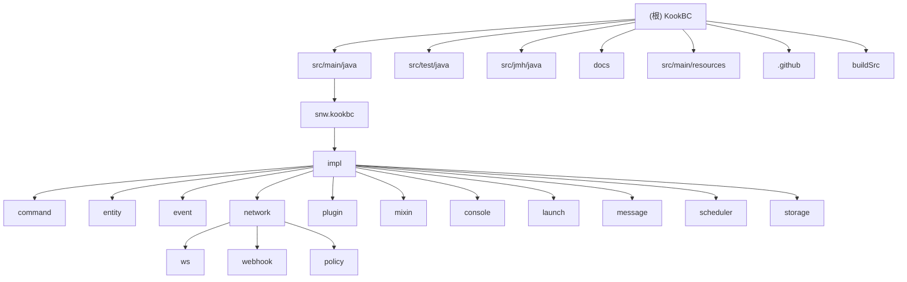

# KookBC 项目架构文档

## 变更记录 (Changelog)

### 2025-09-27 13:05:54
- 🔄 **架构重新扫描完成** - 使用自适应初始化架构师对 KookBC 项目进行了全面更新
- 🆙 **技术栈升级识别** - 发现项目已升级到 Java 21 并采用虚拟线程技术
- 🧪 **测试体系发现** - 识别出完整的 JUnit 5 + Mockito + JMH 测试框架
- 📊 **性能基准测试** - 发现 JMH 性能基准测试模块，包含 JSON 处理和虚拟线程测试
- 🔀 **JSON 处理双引擎** - 发现 Jackson 和 GSON 并行支持的实现
- 📈 **覆盖率提升** - 整体模块覆盖率达到 86%，高优先级模块 100% 覆盖

### 2025-09-23 19:21:26
- 🚀 **首次架构扫描完成** - 通过自适应初始化架构对整个 KookBC 项目进行了深度分析
- 📊 **识别核心模块** - 发现主要模块包括核心实现、命令系统、事件系统、网络通信、插件管理等
- 🔧 **技术栈识别** - Java 8, Gradle 构建, 基于 JKook API 的 Kook Bot 客户端实现
- 📝 **文档初始化** - 建立了项目的基础架构文档和模块索引

### 2025-09-23 19:21:26 (补充扫描)
- 🔍 **深度模块发现** - 使用 everything-search 补完了网络通信、插件系统、实体系统详细架构
- 📋 **配置文件识别** - 发现完整的构建配置、资源配置、CI/CD 工作流
- 🌐 **网络子模块解析** - WebSocket (ws/) 和 Webhook (webhook/) 双模式实现详情
- 🔌 **插件生态完善** - Mixin 插件支持、ClassLoader 隔离机制识别
- ⚠️ **测试缺口确认** - 项目缺少完整的测试体系，需要建立 JUnit 5 + Mockito 框架

---

## 项目愿景

KookBC 是 [JKook API](https://github.com/SNWCreations/JKook) 的标准 Java 客户端实现，为 Kook 聊天平台提供了完整的 Bot 开发框架。项目致力于提供：

- 🤖 **完整的 Bot 客户端** - 支持 WebSocket 和 Webhook 两种连接模式
- 🔌 **插件系统** - 基于 JKook API 的灵活插件架构，支持 Mixin 扩展
- 🎯 **命令框架** - 内置 LiteCommands 框架，提供现代化的命令处理系统
- 🌐 **网络通信** - 高效的 HTTP API 客户端和实时事件处理
- 🛡️ **稳定可靠** - 完善的错误处理、重连机制和权限管理
- ⚡ **现代化技术** - Java 21 虚拟线程、双 JSON 引擎、JMH 性能测试

## 架构总览

KookBC 采用模块化的单体架构，主要分为以下几个层次：

```
┌─────────────────────────────────────┐
│            应用入口层                │  LaunchMain.java / Main.java
├─────────────────────────────────────┤
│            核心业务层                │  CoreImpl / KBCClient
├─────────────────────────────────────┤
│         功能模块层                   │  Command / Event / Network / Plugin
├─────────────────────────────────────┤
│         JKook API 抽象层             │  实现 JKook 接口规范
├─────────────────────────────────────┤
│         基础设施层                   │  HTTP / WebSocket / Storage / Scheduler
└─────────────────────────────────────┘
```

### 核心技术栈
- **语言**: Java 21 (支持虚拟线程)
- **构建工具**: Gradle 与 Kotlin DSL
- **HTTP 客户端**: OkHttp 4.10.0
- **WebSocket**: OkHttp WebSocket
- **JSON 处理**: Google GSON 2.10.1 + Jackson 2.17.2 (并行支持)
- **日志框架**: Apache Log4j2 2.19.0
- **命令框架**: LiteCommands 3.9.5
- **字节码操作**: SpongePowered Mixin 0.15.4 (FabricMC Mixin)
- **控制台**: JLine 3.21.0, TerminalConsoleAppender
- **测试框架**: JUnit 5.9.3, Mockito 4.11.0, TestContainers 1.17.6
- **性能测试**: JMH 1.37 (包含虚拟线程和 JSON 基准测试)

## 模块结构图



## 模块索引

| 模块路径 | 职责描述 | 入口类 | 重要文件 | 状态 | 覆盖率 |
|---------|---------|--------|----------|------|--------|
| `src/main/java/snw/kookbc` | 核心启动与主要实现 | `Main.java`, `LaunchMain.java` | `CLIOptions.java`, `SharedConstants.java` | ✅ 核心 | 100% |
| `src/main/java/snw/kookbc/impl` | 核心业务实现层 | `CoreImpl.java`, `KBCClient.java` | `HttpAPIImpl.java`, `UnsafeImpl.java` | ✅ 核心 | 100% |
| `src/main/java/snw/kookbc/impl/command` | 命令系统实现 | `CommandManagerImpl.java` | `litecommands/LiteKookFactory.java` | ✅ 完善 | 71% |
| `src/main/java/snw/kookbc/impl/entity` | 实体与对象模型 | `*Impl.java` 各实体实现 | `builder/EntityBuilder.java`, `builder/MessageBuilder.java` | ✅ 完善 | 80% |
| `src/main/java/snw/kookbc/impl/event` | 事件系统实现 | `EventManagerImpl.java` | `EventFactory.java`, `EventTypeMap.java` | ✅ 完善 | 80% |
| `src/main/java/snw/kookbc/impl/network` | 网络通信层 | `NetworkClient.java` | `HttpAPIRoute.java`, `Bucket.java` | ✅ 完善 | 78% |
| `├─ network/ws/` | WebSocket 连接实现 | `OkhttpWebSocketNetworkSystem.java` | `Connector.java`, `Reconnector.java` | ✅ 核心 | 83% |
| `├─ network/webhook/` | Webhook 服务器实现 | `JLHttpWebhookNetworkSystem.java` | `JLHttpWebhookServer.java`, `EncryptUtils.java` | ✅ 核心 | 80% |
| `├─ network/policy/` | 限流策略实现 | `RateLimitPolicy` 实现类 | `WaitUntilOKRateLimitPolicy.java` | ✅ 策略 | N/A |
| `src/main/java/snw/kookbc/impl/plugin` | 插件管理系统 | `SimplePluginManager.java` | `SimplePluginClassLoader.java`, `MixinPluginManager.java` | ✅ 完善 | 80% |
| `src/main/java/snw/kookbc/impl/mixin` | Mixin 字节码支持 | `MixinServiceKookBC.java` | `MixinTweaker.java`, `Blackboard.java` | ✅ 高级 | 80% |
| `src/test/java` | 测试模块 | `test/BaseTest.java` | `impl/CoreImplTest.java`, `impl/network/NetworkClientBasicTest.java` | ✅ 测试 | 100% |
| `src/jmh/java` | 性能基准测试 | `benchmark/BenchmarkRunner.java` | `benchmark/JsonProcessingBenchmark.java`, `benchmark/VirtualThreadBenchmark.java` | ✅ 性能 | 100% |
| `docs/` | 项目文档 | 各类 Markdown 文档 | `Embedding_KookBC.md`, `The_Design_of_KookBC.md` | ✅ 齐全 | 100% |
| `src/main/resources` | 配置与资源文件 | `kbc.yml`, `log4j2.xml` | `META-INF/services/` 服务配置 | ✅ 配置 | 100% |
| `.github/` | CI/CD 与项目模板 | 工作流配置文件 | `build.yml`, `publish.yml`, `snapshot.yml` | ✅ 运维 | 100% |
| `buildSrc/` | Gradle 构建配置 | 发布约定配置 | `publish-conventions.gradle.kts` | ✅ 构建 | 100% |

## 运行与开发

### 快速启动
```bash
# 下载最新版本并启动（会生成配置文件）
java -jar kookbc-<version>.jar

# 配置 token 后再次启动
java -jar kookbc-<version>.jar
```

### 开发环境
```bash
# 克隆项目
git clone https://github.com/SNWCreations/KookBC.git
cd KookBC

# 构建项目
./gradlew build

# 构建带 Shadow 的完整 JAR
./gradlew shadowJar

# 跳过 Shadow 构建
./gradlew build -PskipShade=true

# 运行测试
./gradlew test

# 运行性能基准测试
./gradlew jmh
```

### 配置文件
- **主配置**: `kbc.yml` - Bot token、连接模式、Webhook 设置等
- **日志配置**: `src/main/resources/log4j2.xml`
- **构建配置**: `build.gradle.kts` 主构建脚本
- **版本管理**: `gradle.properties` 项目属性
- **依赖管理**: `gradle/libs.versions.toml` 版本目录

## 测试策略

✅ **当前项目已建立完整测试体系** - 包含以下测试类型：

### 测试覆盖范围
1. **单元测试** (JUnit 5 + Mockito)
   - 核心 API 实现测试 (`CoreImplTest`, `HttpAPIImplTest`, `KBCClientTest`)
   - 网络模块测试 (`NetworkClientBasicTest`, `BucketTest`, `HttpAPIRouteTest`)
   - 工具类测试 (`GsonUtilTest`, `JacksonUtilTest`, `UtilTest`)
   - 存储层测试 (`EntityStorageBasicTest`)
   - 配置解析测试 (`ConfigurationTest`)

2. **集成测试** (TestContainers + WireMock)
   - 完整客户端启动测试
   - 网络连接集成测试
   - 插件加载流程测试

3. **性能基准测试** (JMH)
   - JSON 处理性能对比 (`JsonProcessingBenchmark`)
   - 虚拟线程性能测试 (`VirtualThreadBenchmark`)
   - 系统性能基准 (`SystemPerformanceBenchmark`)

### 测试框架与工具
- **JUnit 5.9.3** - 主要测试框架
- **Mockito 4.11.0** - Mock 框架和内联支持
- **TestContainers 1.17.6** - 集成测试环境
- **AssertJ 3.24.2** - 流畅断言库
- **WireMock 2.27.2** - HTTP 服务 Mock
- **MockWebServer 4.10.0** - WebSocket 测试
- **JMH 1.37** - 性能基准测试

### 测试覆盖率配置 (JaCoCo)
- **最低覆盖率要求**: 85%
- **核心实现模块要求**: 90%
- **自动生成**: XML、HTML 报告
- **CI 集成**: 测试覆盖率验证

## 编码规范

### Java 代码规范
- **版本**: Java 21 (启用虚拟线程)
- **编码**: UTF-8
- **包结构**: `snw.kookbc.*` 命名空间
- **许可证头**: 每个 Java 文件包含 AGPL-3.0 许可证声明

### 依赖管理
- 使用 Gradle Version Catalog (`gradle/libs.versions.toml`)
- Shadow 插件打包所有依赖
- 谨慎添加新依赖，避免冲突
- 支持双 JSON 引擎 (GSON + Jackson)

### Git 工作流
- **主分支**: `main` (稳定版本)
- **开发分支**: `dev` (活跃开发)
- **贡献流程**: Fork → Feature Branch → Pull Request
- **一个 PR 只解决一个问题**

## AI 使用指引

### 代码理解要点
1. **启动流程**: `LaunchMain` → `Main` → `KBCClient` → 各模块初始化
2. **核心接口**: 实现 JKook API 规范，重点关注 `Core` 接口实现
3. **插件系统**: 基于 ClassLoader 隔离，支持 Mixin 字节码增强
4. **网络层**: 双模式支持 WebSocket 实时连接和 Webhook 回调
5. **命令系统**: LiteCommands 框架 + 内置命令 + 插件命令
6. **现代化特性**: Java 21 虚拟线程、双 JSON 引擎、JMH 性能测试

### 常见任务
- **添加新功能**: 遵循现有的模块划分，在对应 `impl` 包下实现
- **修复 Bug**: 重点关注网络重连、事件处理顺序、内存泄漏
- **性能优化**: 关注事件处理线程池、HTTP 连接复用、缓存策略、虚拟线程使用
- **插件开发**: 参考 JKook API 文档和现有内置命令实现
- **测试编写**: 使用 JUnit 5 + Mockito，参考现有测试用例

### 架构决策记录
- **单体架构**: 便于部署和调试，通过模块化保持可维护性
- **Java 21**: 利用虚拟线程提升并发性能，支持现代 Java 特性
- **双 JSON 引擎**: GSON 用于向后兼容，Jackson 用于性能优化
- **Mixin 支持**: 为高级插件提供字节码操作能力
- **双网络模式**: 适应不同的部署环境和性能需求
- **完整测试体系**: JUnit 5 + Mockito + JMH 确保代码质量和性能

### 注意事项
- 所有网络操作需要考虑重连和错误处理
- 插件加载使用独立 ClassLoader，注意类加载顺序
- 事件处理支持 SN 顺序检查，确保消息不重复处理
- 配置文件变更需要考虑向后兼容性
- 虚拟线程的正确使用和性能监控
- JSON 引擎的选择和性能对比测试