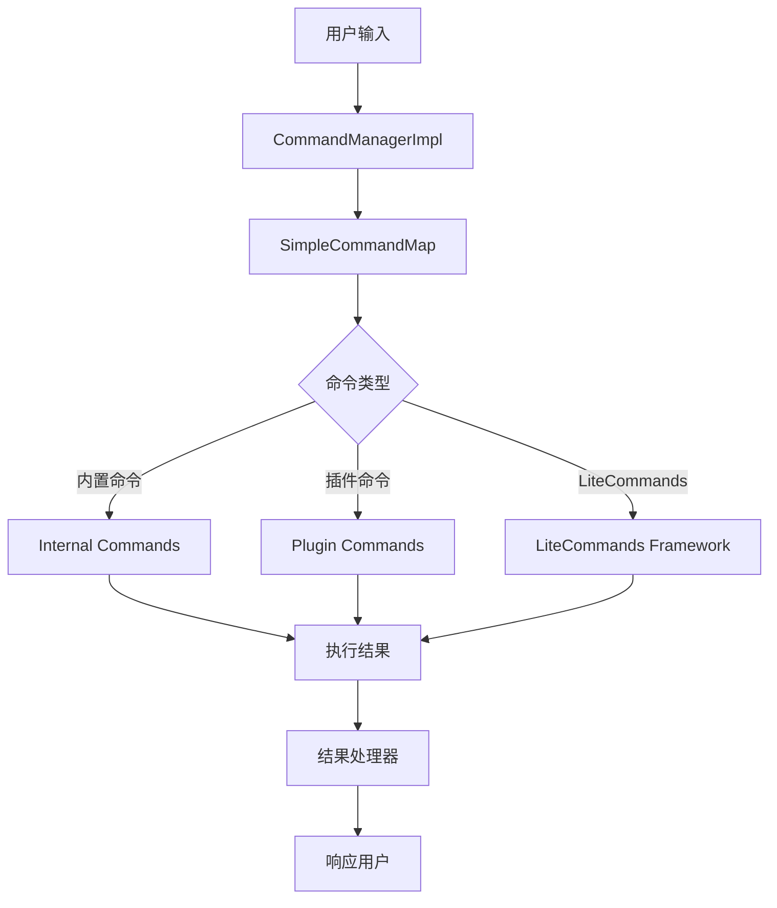
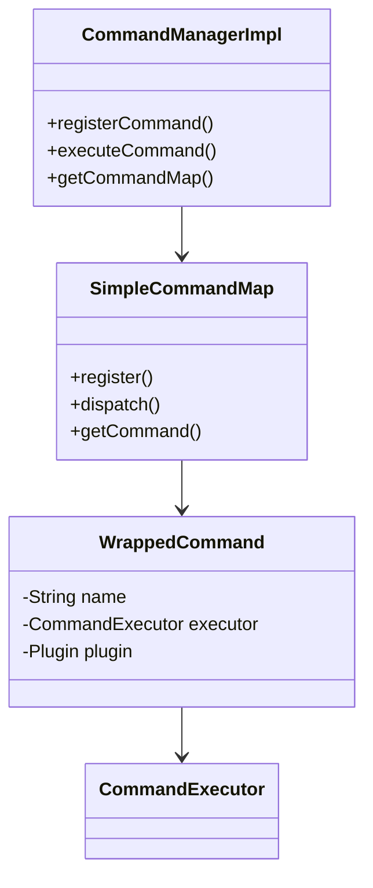

[根目录](../../../../CLAUDE.md) > [src](../../../) > [main](../../) > [java](../) > [snw.kookbc.impl](./) > **command**

---

# 命令系统模块 (snw.kookbc.impl.command)

## 模块职责

命令系统模块是 KookBC 的交互核心，负责处理用户输入的命令并执行相应操作。该模块提供了：

- 🎯 **命令注册与管理** - 支持插件命令和内置命令的统一管理
- 🔍 **命令解析与路由** - 智能的命令匹配和参数解析
- 🚀 **LiteCommands 集成** - 现代化的注解驱动命令框架
- 🎪 **控制台命令支持** - 支持控制台和聊天频道的双重执行环境
- 🛡️ **权限验证** - 完整的权限检查和验证机制

## 入口与启动

### 主要入口类

#### CommandManagerImpl.java
```java
public class CommandManagerImpl implements CommandManager
```
- **职责**: JKook CommandManager 接口的实现
- **核心功能**:
  - 命令注册 (`registerCommand()`)
  - 命令执行 (`executeCommand()`)
  - 命令映射管理 (`CommandMap`)
- **初始化**: 在 CoreImpl 中创建并注册到 JKook.getCore()

#### SimpleCommandMap.java
```java
public class SimpleCommandMap implements CommandMap
```
- **职责**: 命令映射的具体实现
- **功能特性**:
  - 命令别名支持
  - 前缀匹配
  - 冲突检测和解决

## 对外接口

### 核心命令接口
```java
// 命令注册
public void registerCommand(Plugin plugin, Command command)

// 命令执行
public boolean executeCommand(CommandSender sender, String commandLine)

// 获取命令映射
public CommandMap getCommandMap()
```

### LiteCommands 集成
- **平台适配**: `KookLitePlatform.java` - Kook 平台的 LiteCommands 适配器
- **发送者封装**: `KookSender.java` - 命令发送者的统一抽象
- **结果处理**: `ReplyResultHandler.java` - 命令执行结果的响应处理

### 内置命令
| 命令 | 类名 | 功能 | 权限要求 |
|------|------|------|----------|
| `help` | `HelpCommand.java` | 显示帮助信息 | 无 |
| `stop` | `StopCommand.java` | 停止 Bot | 控制台专用 |
| `plugins` | `PluginsCommand.java` | 列出已加载插件 | 无 |

## 关键依赖与配置

### 外部依赖
```gradle
// LiteCommands 框架
api("dev.rollczi:litecommands-framework")
```

### 内部依赖
- **权限系统**: `snw.kookbc.impl.permissions.*`
- **事件系统**: `snw.kookbc.impl.event.*` (命令事件)
- **实体系统**: `snw.kookbc.impl.entity.*` (用户、频道)

### 配置项 (kbc.yml)
```yaml
# 内置命令开关
internal-commands:
  stop: true
  help: true
  plugins: true

# 命令回复类型
internal-commands-reply-result-type: REPLY  # REPLY/REPLY_TEMP/SEND/SEND_TEMP

# 错误反馈
allow-error-feedback: true
```

## 数据模型

### 命令对象模型
```java
// 包装命令
public class WrappedCommand {
    private final String name;
    private final String[] aliases;
    private final CommandExecutor executor;
    private final Plugin plugin;
}

// 控制台命令发送者
public class ConsoleCommandSenderImpl implements ConsoleCommandSender {
    // 控制台特有的权限和输出处理
}
```

### LiteCommands 注解
```java
// 权限注解
@KookPermission("permission.node")

// 前缀注解
@Prefix("!")

// 结果类型注解
@Result(ResultType.REPLY)
```

## 架构设计

### 命令处理流程


### 类关系图


## 测试与质量

### 当前测试覆盖
❌ **缺少测试** - 建议添加以下测试：

### 建议测试用例
1. **命令注册测试**
   - 正常命令注册
   - 重复命令处理
   - 别名冲突检测

2. **命令执行测试**
   - 参数解析正确性
   - 权限验证流程
   - 异常情况处理

3. **LiteCommands 集成测试**
   - 注解解析
   - 参数类型转换
   - 结果处理

### 性能考虑
- **命令查找**: 使用 HashMap 进行 O(1) 命令查找
- **参数解析**: 懒加载，只在需要时解析参数
- **结果缓存**: 帮助信息等静态内容缓存

## 常见问题 (FAQ)

### Q: 如何注册一个新的命令？
A: 实现 `CommandExecutor` 接口，然后通过 `CommandManager.registerCommand()` 注册：
```java
JKook.getCore().getCommandManager().registerCommand(plugin, new MyCommand());
```

### Q: LiteCommands 和传统命令有什么区别？
A: LiteCommands 使用注解驱动，支持自动参数解析和类型转换，而传统命令需要手动解析参数。LiteCommands 更适合复杂命令。

### Q: 如何处理命令权限？
A: 使用 `@KookPermission` 注解或在 `CommandExecutor` 中手动检查权限：
```java
if (!sender.hasPermission("my.permission")) {
    sender.sendMessage("权限不足");
    return false;
}
```

### Q: 控制台命令和用户命令有什么区别？
A: 控制台命令使用 `ConsoleCommandSenderImpl`，拥有最高权限且无频道限制；用户命令需要权限验证且在特定频道执行。

## 相关文件清单

### 核心命令文件
```
src/main/java/snw/kookbc/impl/command/
├── CommandManagerImpl.java        # 命令管理器实现
├── SimpleCommandMap.java          # 命令映射实现
├── WrappedCommand.java            # 命令包装类
├── ConsoleCommandSenderImpl.java  # 控制台发送者
└── UnknownArgumentException.java  # 参数异常
```

### LiteCommands 集成
```
src/main/java/snw/kookbc/impl/command/litecommands/
├── KookLitePlatform.java          # Kook 平台适配
├── KookSender.java                # 发送者封装
├── LiteKookFactory.java           # 工厂类
├── LiteKookCommandExecutor.java   # 执行器
├── ReplyResultHandler.java        # 结果处理
├── annotations/                   # 注解定义
│   ├── permission/
│   ├── prefix/
│   └── result/
├── argument/                      # 参数解析器
├── internal/                      # 内置命令
└── result/                        # 结果类型
```

## 变更记录 (Changelog)

### 2025-09-23 19:21:26
- 📊 **模块文档创建** - 初始化命令系统模块的架构文档
- 🔍 **代码分析完成** - 分析了核心命令管理类和 LiteCommands 集成
- 📝 **接口文档整理** - 梳理了命令注册、执行流程和权限机制
- 🏗️ **架构图绘制** - 创建了命令处理流程和类关系图
- ⚠️ **测试缺口识别** - 发现缺少自动化测试，提出了测试建议