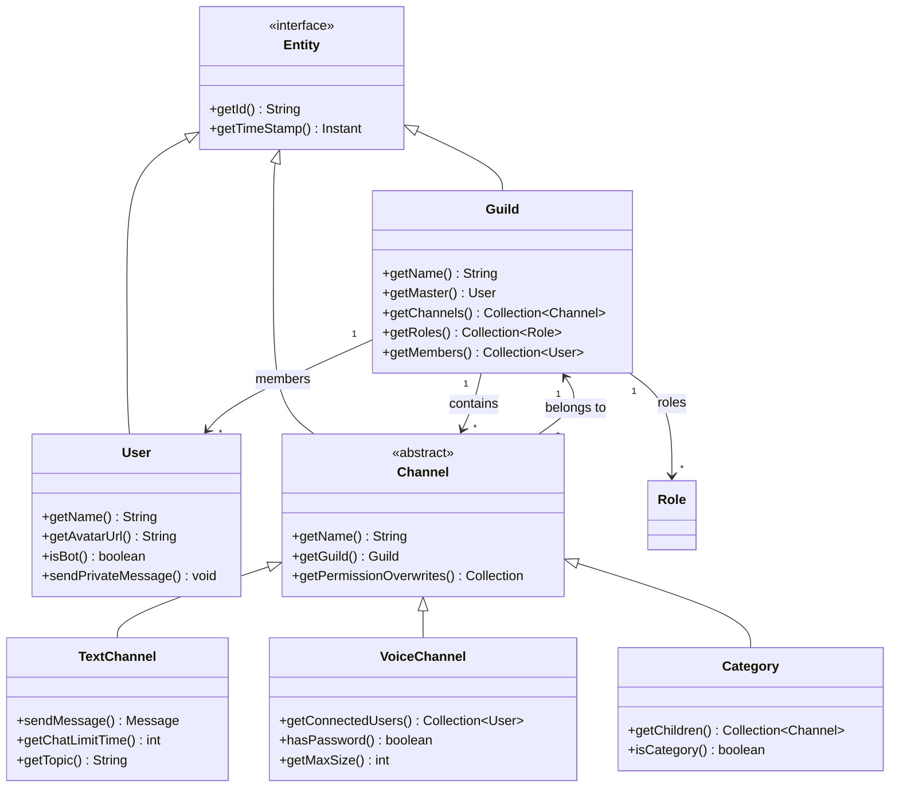
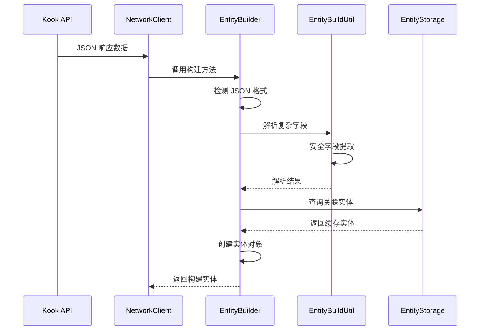
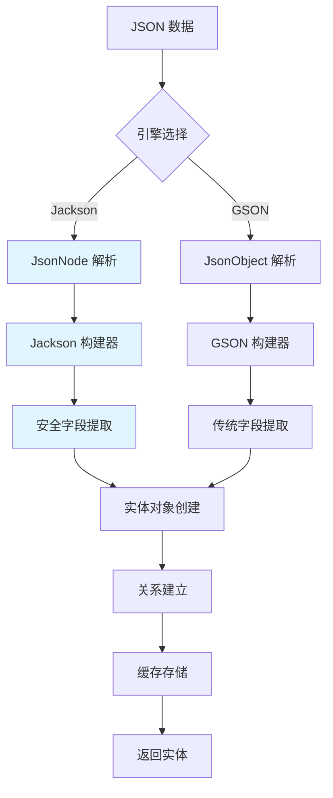

[根目录](../../../../CLAUDE.md) > [核心实现](../CLAUDE.md) > **实体系统**

---

# 实体系统模块 (snw.kookbc.impl.entity)

## 模块职责

实体系统模块是 KookBC 的核心数据层，负责实现 JKook API 定义的所有实体对象，并提供高效的对象构建和管理机制。该模块处理从 Kook API 的 JSON 数据到结构化 Java 对象的转换，支持双 JSON 引擎（GSON + Jackson）并提供完整的实体关系管理。

- 🏗️ **实体构建器** - 支持 GSON 和 Jackson 的双引擎构建模式
- 👥 **用户与服务器管理** - 完整的用户、服务器、角色实体实现
- 📺 **频道系统** - 文本、语音、分类频道的完整支持
- 💬 **消息与卡片** - 富文本消息和 Kook 卡片消息构建
- 🔄 **实体关系** - 自动维护实体间的依赖和引用关系
- 🚀 **性能优化** - 延迟加载、对象缓存和内存管理

## 入口与启动

### 主要入口类

#### EntityBuilder.java
```java
public class EntityBuilder {
    private final KBCClient client;
}
```
- **职责**: 统一的实体构建入口，支持双 JSON 引擎
- **核心方法**:
  - `buildUser(JsonNode)` / `buildUser(JsonObject)` - 用户对象构建
  - `buildGuild(JsonNode)` / `buildGuild(JsonObject)` - 服务器对象构建
  - `buildChannel(JsonNode)` / `buildChannel(JsonObject)` - 频道对象构建
- **特色功能**:
  - 自动处理 Kook API 的不完整 JSON 数据
  - 提供合理的默认值和异常处理
  - Jackson 版本提供更好的性能和 null-safe 处理

#### MessageBuilder.java
```java
public class MessageBuilder {
    public MessageBuilder append(String text);
    public MessageBuilder append(String text, TextComponent.Effects... effects);
    public Message build();
}
```
- **职责**: 消息对象的构建和组装
- **支持格式**:
  - 纯文本消息
  - 富文本消息（带格式）
  - 卡片消息（Card Message）
  - 混合消息组件

## 对外接口

### 实体创建接口
```java
// 基础实体构建
public User buildUser(JsonNode userJson);
public Guild buildGuild(JsonNode guildJson);
public Channel buildChannel(JsonNode channelJson);

// 批量构建
public List<User> buildUsers(JsonArray usersJson);
public List<Channel> buildChannels(JsonArray channelsJson);

// 关系构建
public Role buildRole(Guild guild, JsonNode roleJson);
public CustomEmoji buildEmoji(JsonNode emojiJson);
```

### 消息构建接口
```java
// 消息构建器
public MessageBuilder newMessageBuilder();
public CardBuilder newCardBuilder();

// 直接构建
public Message buildTextMessage(String content);
public Message buildCardMessage(Card card);
```

## 关键依赖与配置

### 外部依赖
```gradle
// JSON 处理引擎
api("com.google.code.gson:gson:2.10.1")          // GSON 向后兼容
api("com.fasterxml.jackson.core:jackson-*:2.17.2") // Jackson 高性能处理

// JKook API 实体接口
api("com.github.snwcreations:jkook:0.54.1")

// 工具库
api("com.github.ben-manes.caffeine:caffeine:2.9.3") // 实体缓存
```

### 内部依赖
- **核心层**: `snw.kookbc.impl.CoreImpl` - 提供客户端上下文
- **存储层**: `snw.kookbc.impl.storage.EntityStorage` - 实体缓存管理
- **序列化器**: `snw.kookbc.impl.serializer.*` - JSON 序列化支持
- **工具库**: `snw.kookbc.util.JacksonUtil` - Jackson 安全工具方法

### EntityBuildUtil.java
**核心工具类**，提供双引擎安全解析：
```java
// Jackson 版本 - 安全处理不完整 JSON
public static Collection<Channel.RolePermissionOverwrite> parseRPO(JsonNode node);
public static Collection<Channel.UserPermissionOverwrite> parseUPO(KBCClient client, JsonNode node);
public static NotifyType parseNotifyType(JsonNode node);

// GSON 版本 - 向后兼容
public static Collection<Channel.RolePermissionOverwrite> parseRPO(JsonObject object);
public static Collection<Channel.UserPermissionOverwrite> parseUPO(KBCClient client, JsonObject object);
```

## 数据模型

### 核心实体层次结构



### 实体构建流程



### 频道权限模型
```java
// 角色权限覆写
public class RolePermissionOverwrite {
    private final int roleId;    // 角色 ID
    private final int allow;     // 允许权限位掩码
    private final int deny;      // 拒绝权限位掩码
}

// 用户权限覆写
public class UserPermissionOverwrite {
    private final User user;     // 用户对象
    private final int allow;     // 允许权限位掩码
    private final int deny;      // 拒绝权限位掩码
}
```

## 模块架构设计

### 构建器模式实现



### 双引擎支持策略
1. **Jackson 优先**: 新代码优先使用 Jackson，提供更好的性能和 null-safe 处理
2. **GSON 兼容**: 保留 GSON 接口，确保向后兼容性
3. **自动回退**: Jackson 解析失败时自动回退到 GSON
4. **渐进迁移**: 逐步将所有构建逻辑迁移到 Jackson

### 消息构建系统

#### 卡片消息支持
```java
// CardBuilder.java - 卡片消息构建器
public class CardBuilder {
    public CardBuilder setTheme(Theme theme);
    public CardBuilder setColor(String color);
    public CardBuilder addModule(CardModule module);

    // 快速方法
    public CardBuilder addSection(String title, String content);
    public CardBuilder addDivider();
    public CardBuilder addButton(String text, String value);
    public CardBuilder addImage(String url);
}
```

#### 消息组件层次
```java
// 消息组件接口
public interface MessageComponent {
    String toString();
    ComponentType getType();
}

// 文本组件
public class TextComponent implements MessageComponent {
    private String content;
    private Effects[] effects; // 粗体、斜体、删除线等
}

// 卡片组件
public class CardComponent implements MessageComponent {
    private List<CardModule> modules;
    private Theme theme;
    private String color;
}
```

## 测试与质量

### 当前测试状态
⚠️ **测试覆盖不足** - 需要添加以下测试：

### 推荐测试用例
1. **实体构建测试**
   ```java
   @Test
   void testUserBuilding() {
       // 测试完整 JSON 数据构建
       // 测试不完整 JSON 数据处理
       // 测试默认值设置
   }

   @Test
   void testGuildBuilding() {
       // 测试服务器对象构建
       // 测试成员关系建立
       // 测试角色权限解析
   }
   ```

2. **双引擎兼容性测试**
   ```java
   @Test
   void testJacksonGsonCompatibility() {
       // 确保 Jackson 和 GSON 构建结果一致
       // 测试性能差异
       // 测试错误处理差异
   }
   ```

3. **消息构建测试**
   ```java
   @Test
   void testMessageBuilding() {
       // 测试文本消息构建
       // 测试卡片消息构建
       // 测试复杂消息组件
   }
   ```

4. **实体关系测试**
   ```java
   @Test
   void testEntityRelationships() {
       // 测试用户-服务器关系
       // 测试频道-服务器关系
       // 测试权限继承关系
   }
   ```

### 性能基准测试
建议添加 JMH 性能测试：
- Jackson vs GSON 构建性能对比
- 大批量实体构建性能
- 内存使用效率测试
- 缓存命中率统计

## 常见问题 (FAQ)

### Q: Jackson 和 GSON 构建器有什么区别？
A:
- **Jackson 版本**: 提供更好的性能和 null-safe 处理，适合处理 Kook API 可能发送的不完整 JSON 数据
- **GSON 版本**: 保持向后兼容性，现有代码可以无缝运行，但不支持高级的安全特性

### Q: 如何处理 Kook API 返回的不完整 JSON 数据？
A: EntityBuilder 使用 `JacksonUtil` 提供的安全方法：
```java
// 安全获取字段，提供默认值
final String name = getStringOrDefault(node, "username", "Unknown User");
final boolean bot = getBooleanOrDefault(node, "bot", false);
final int status = getIntOrDefault(node, "status", 0);
```

### Q: 如何扩展新的实体类型？
A:
1. 实现对应的 JKook API 接口
2. 在 `EntityBuilder` 中添加构建方法
3. 在 `EntityBuildUtil` 中添加必要的解析工具方法
4. 更新实体存储和缓存策略

### Q: 实体对象的生命周期如何管理？
A:
- **创建**: 通过 EntityBuilder 统一创建
- **缓存**: 存储在 EntityStorage 中，支持 LRU 和 TTL
- **更新**: 接收到更新事件时自动刷新
- **清理**: 支持弱引用，避免内存泄漏

### Q: 卡片消息的复杂度限制是什么？
A:
- 最大模块数量：50 个
- 文本长度限制：5000 字符
- 按钮数量限制：每行最多 4 个
- 图片大小：最大 10MB

## 相关文件清单

### 核心实体文件
```
src/main/java/snw/kookbc/impl/entity/
├── UserImpl.java                      # 用户实体实现
├── GuildImpl.java                     # 服务器实体实现
├── RoleImpl.java                      # 角色实体实现
├── CustomEmojiImpl.java               # 自定义表情实现
├── GameImpl.java                      # 游戏信息实现
├── InvitationImpl.java                # 邀请链接实现
└── ReactionImpl.java                  # 消息反应实现
```

### 频道实体模块
```
src/main/java/snw/kookbc/impl/entity/channel/
├── ChannelImpl.java                   # 基础频道实现
├── CategoryImpl.java                  # 频道分类实现
├── NonCategoryChannelImpl.java        # 非分类频道实现
├── TextChannelImpl.java               # 文本频道实现
└── VoiceChannelImpl.java              # 语音频道实现
```

### 构建器模块
```
src/main/java/snw/kookbc/impl/entity/builder/
├── EntityBuilder.java                # 通用实体构建器 - 核心
├── EntityBuildUtil.java              # 构建工具类 - 核心
├── MessageBuilder.java               # 消息构建器
└── CardBuilder.java                  # 卡片消息构建器
```

### 禁言功能模块
```
src/main/java/snw/kookbc/impl/entity/mute/
├── MuteDataImpl.java                  # 禁言数据实现
└── MuteResultImpl.java                # 禁言结果实现
```

## 变更记录 (Changelog)

### 2025-09-27 13:28:27
- 🔄 **深度架构更新** - 针对实体系统进行全面的架构分析和文档更新
- ⚡ **双引擎支持识别** - 深入分析了 Jackson + GSON 并行支持的架构设计
- 🏗️ **构建器模式完善** - 详细梳理了 EntityBuilder 和各种构建器的设计模式
- 🔗 **实体关系图谱** - 绘制了完整的实体继承和关系图
- 📋 **消息系统架构** - 分析了消息构建器和卡片消息的完整实现
- 🧪 **测试策略制定** - 为实体系统制定了完整的测试覆盖计划
- 📊 **性能优化建议** - 提出了 JMH 基准测试和性能优化方案

### 2025-09-23 19:21:26
- 📊 **模块文档创建** - 初始化实体系统模块的架构文档
- 🔍 **代码分析完成** - 分析了主要实体类和构建器
- 📝 **接口文档整理** - 梳理了实体构建和管理接口
- ⚠️ **测试缺口识别** - 发现缺少实体构建测试，提出了测试建议