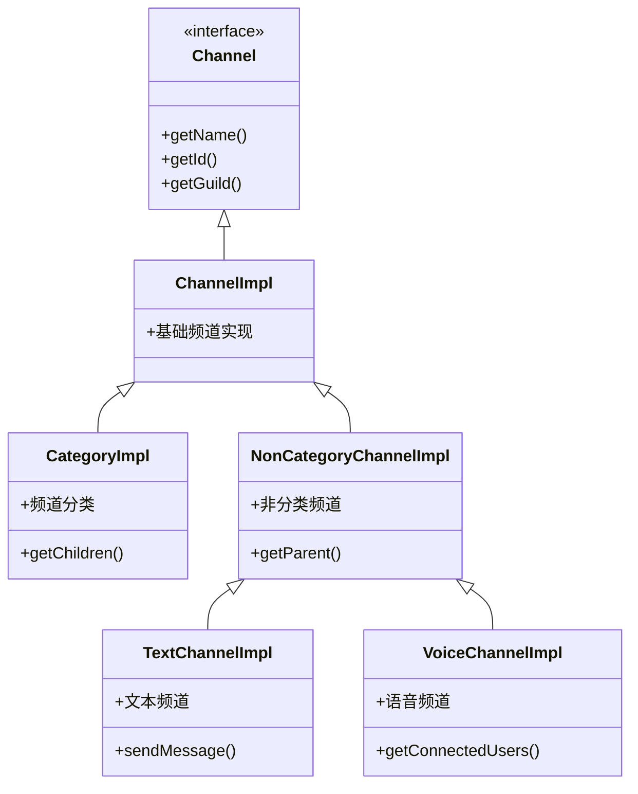

# 实体系统模块文档

> 📍 **导航路径**: [KookBC 根目录](../../../../../../../../CLAUDE.md) → [核心实现](../CLAUDE.md) → **实体系统**

## 模块概述

实体系统模块 (`snw.kookbc.impl.entity`) 实现了 JKook API 定义的所有核心实体对象，包括用户、服务器、频道、消息等。该模块负责将 Kook API 的 JSON 数据转换为结构化的 Java 对象，并提供丰富的操作接口。

## 核心架构

### 📁 模块结构

```
src/main/java/snw/kookbc/impl/entity/
├── builder/                           # 构建器模式实现
│   ├── CardBuilder.java              # 卡片消息构建器
│   ├── EntityBuilder.java            # 通用实体构建器 - 核心创建逻辑
│   ├── EntityBuildUtil.java          # 构建工具类
│   └── MessageBuilder.java           # 消息构建器 - 重要组件
├── channel/                           # 频道相关实体
│   ├── CategoryImpl.java             # 频道分类实现
│   ├── ChannelImpl.java              # 基础频道实现
│   ├── NonCategoryChannelImpl.java   # 非分类频道实现
│   ├── TextChannelImpl.java          # 文本频道实现
│   └── VoiceChannelImpl.java         # 语音频道实现
├── mute/                              # 禁言相关实体
│   ├── MuteDataImpl.java             # 禁言数据实现
│   └── MuteResultImpl.java           # 禁言结果实现
├── CustomEmojiImpl.java              # 自定义表情实现
├── GameImpl.java                     # 游戏信息实现
├── GuildImpl.java                    # 服务器实现 - 核心实体
├── InvitationImpl.java               # 邀请链接实现
├── ReactionImpl.java                 # 消息反应实现
├── RoleImpl.java                     # 用户角色实现
└── UserImpl.java                     # 用户实体实现 - 核心实体
```

## 核心组件详解

### 🏗️ EntityBuilder.java
**职责**: 通用实体构建工厂
- 根据 JSON 数据创建各种实体对象
- 统一的实体创建入口点
- 处理实体间的依赖关系

**关键方法**:
```java
public static Guild buildGuild(Core core, JsonObject object)
public static User buildUser(Core core, JsonObject object)
public static Channel buildChannel(Core core, JsonObject object)
```

### 💬 MessageBuilder.java
**职责**: 消息对象构建器
- 构建各种类型的消息对象
- 处理消息组件和附件
- 支持卡片消息和富文本消息

**核心功能**:
- 文本消息构建
- 卡片消息构建
- 消息组件解析

### 🏢 GuildImpl.java
**职责**: 服务器(公会)实体实现
- 实现 JKook API 的 Guild 接口
- 管理服务器成员、频道、角色
- 提供服务器操作 API

**重要功能**:
- 成员管理: `getMembers()`, `getMember(String)`
- 频道管理: `getChannels()`, `getTextChannels()`
- 角色管理: `getRoles()`, `createRole()`
- 服务器操作: `leave()`, `delete()`

### 👤 UserImpl.java
**职责**: 用户实体实现
- 实现 JKook API 的 User 接口
- 用户信息管理和操作
- 私聊和用户关系处理

**核心方法**:
- 用户信息: `getNickName()`, `getAvatarUrl()`
- 私聊功能: `sendPrivateMessage()`
- 用户状态: `isOnline()`, `isBanned()`

## 频道系统架构

### 📺 频道继承体系



### 🎭 频道类型支持
- **文本频道**: 支持消息发送、历史查询、权限管理
- **语音频道**: 支持用户连接状态、语音权限管理
- **频道分类**: 支持子频道管理、批量操作
- **私聊频道**: 支持一对一私聊功能

## 构建器模式实现

### 🔧 EntityBuildUtil.java
**工具方法集合**:
```java
// 通用构建方法
public static <T> T buildFromJson(Class<T> clazz, JsonObject json)

// 列表构建方法
public static <T> List<T> buildList(JsonArray array, Function<JsonObject, T> builder)

// 分页数据构建
public static <T> PagedResult<T> buildPagedResult(JsonObject object)
```

### 📋 CardBuilder.java
**卡片消息构建**:
- 支持 Kook 卡片消息格式
- 组件化卡片构建
- 富文本和交互元素支持

## 实体关系管理

### 🔗 核心关系
1. **Guild (服务器)**
   - 包含多个 Channel (频道)
   - 包含多个 User (成员)
   - 包含多个 Role (角色)

2. **User (用户)**
   - 属于多个 Guild
   - 拥有多个 Role (在不同服务器)
   - 可以发送 Message

3. **Channel (频道)**
   - 属于一个 Guild
   - 可以有多个 User 参与
   - 包含多个 Message

### 🔄 数据同步
- 实体对象支持延迟加载
- 自动更新机制保持数据新鲜度
- 缓存策略优化性能

## 使用示例

### 用户操作

```java
// 获取用户信息
User user = core.getHttpAPI().getUser("user_id");
String nickname = user.getNickName();
String avatar = user.getAvatarUrl();

// 发送私聊消息
user.sendPrivateMessage("Hello!");

// 检查用户状态
if (user.isOnline()) {
    // 用户在线
}
```

### 服务器管理

```java
// 获取服务器
Guild guild = core.getHttpAPI().getGuild("guild_id");

// 获取成员列表
Collection<User> members = guild.getMembers();

// 创建频道
TextChannel channel = guild.createTextChannel("新频道");

// 角色管理
Role role = guild.createRole("新角色");
role.setColor(Color.BLUE);
```

### 消息构建

```java
// 文本消息
Message message = new MessageBuilder()
    .append("Hello, ")
    .append("World!", Color.RED)
    .build();

// 卡片消息
CardMessage card = new CardBuilder()
    .addSection("标题", "内容")
    .addButton("点击我", "button_value")
    .build();
```

## 性能优化

### 🚀 优化策略
1. **对象池**: 复用频繁创建的对象
2. **延迟加载**: 按需加载相关数据
3. **缓存机制**: 缓存常用实体数据
4. **批量操作**: 支持批量实体操作

### 📊 内存管理
- 弱引用避免内存泄漏
- 定期清理过期缓存
- 合理的对象生命周期管理

## 扩展点

### 🔌 自定义实体
1. **继承现有实体**: 扩展功能
2. **实现新接口**: 添加新实体类型
3. **自定义构建器**: 特殊构建逻辑

### 🎨 自定义组件
- 消息组件扩展
- 卡片元素定制
- 交互组件开发

## 故障排查

### 常见问题
1. **实体为 null**: 检查 JSON 数据完整性
2. **关系错乱**: 验证实体 ID 对应关系
3. **内存泄漏**: 检查实体引用链
4. **数据不一致**: 确认数据同步机制

### 调试建议
- 启用实体构建日志
- 检查 JSON 原始数据
- 验证 API 响应格式
- 监控实体缓存状态

---

📝 **最后更新**: 2025-09-23 | 📖 **相关文档**: [事件系统模块](../event/CLAUDE.md) | [网络通信模块](../network/CLAUDE.md)