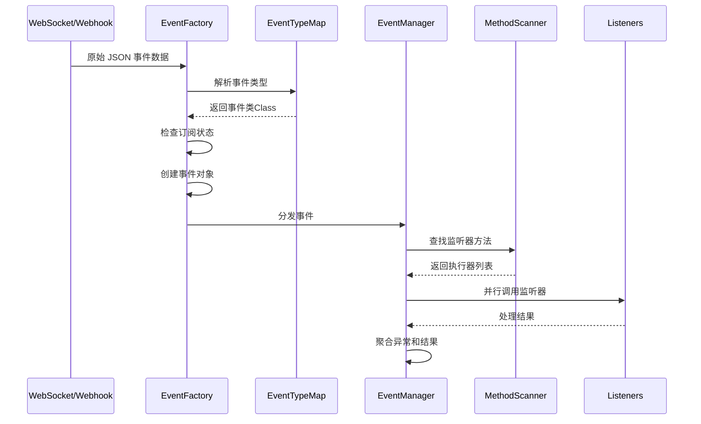
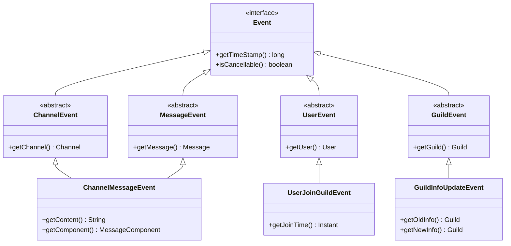

[根目录](../../../../CLAUDE.md) > [核心实现](../CLAUDE.md) > **事件系统**

---

# 事件系统模块 (snw.kookbc.impl.event)

## 模块职责

事件系统模块是 KookBC 的核心响应机制，负责处理来自 Kook 平台的所有实时事件，包括消息接收、用户状态变化、服务器操作、频道变更等。该模块实现了高效的事件分发机制，支持插件系统的事件监听，并确保事件按正确顺序处理且不重复。

- 🎯 **事件管理器** - 基于 Kyori EventBus 的高性能事件分发系统
- 🏭 **事件工厂** - 支持 GSON 和 Jackson 双引擎的事件对象创建
- 🗺️ **类型映射** - 完整的 Kook API 事件类型到 JKook 事件的映射
- 🔍 **方法扫描** - 基于注解的事件监听器自动发现和注册
- 🔒 **线程安全** - 多线程环境下的安全事件处理
- ⚡ **性能优化** - 事件订阅状态检查和无用事件过滤

## 入口与启动

### 主要入口类

#### EventManagerImpl.java
```java
public class EventManagerImpl implements EventManager {
    private final EventBus<Event> bus;
    private final MethodSubscriptionAdapter<Listener> msa;
    private final Map<Plugin, List<Listener>> listeners;
}
```
- **职责**: JKook EventManager 接口的核心实现
- **核心功能**:
  - `callEvent(Event)` - 事件分发和调用
  - `registerHandlers(Plugin, Listener)` - 注册插件事件监听器
  - `unregisterAllHandlers(Plugin)` - 插件卸载时清理监听器
  - `isSubscribed(Class<? extends Event>)` - 检查事件订阅状态
- **架构特点**:
  - 基于 Kyori EventBus 提供高性能事件分发
  - 支持插件级别的监听器管理
  - 异常安全的事件处理机制

#### EventFactory.java
```java
public class EventFactory {
    protected final Gson gson;
    protected final ObjectMapper jacksonMapper;

    public Event getEvent(JsonObject object);      // GSON 兼容版本
    public Event createEvent(JsonNode object);     // Jackson 高性能版本
}
```
- **职责**: 事件对象的创建和反序列化工厂
- **双引擎支持**:
  - GSON 版本：保持向后兼容性
  - Jackson 版本：提供更好的性能和 null-safe 处理
- **智能过滤**:
  - 检查事件订阅状态，避免创建无用事件对象
  - 支持命令系统的特殊事件处理逻辑

### 事件处理流程架构



## 对外接口

### 事件管理接口
```java
// 事件注册和注销
public void registerHandlers(Plugin plugin, Listener listener);
public void unregisterHandlers(Listener listener);
public void unregisterAllHandlers(Plugin plugin);

// 事件分发
public void callEvent(Event event);

// 订阅状态查询
public boolean isSubscribed(Class<? extends Event> eventType);
```

### 事件监听器接口
```java
// 基础监听器接口
public interface Listener {
    // 标记接口，方法通过 @EventHandler 注解标识
}

// 事件处理注解
@EventHandler(priority = EventPriority.NORMAL, ignoreCancelled = false)
public void onEvent(SomeEvent event) {
    // 事件处理逻辑
}
```

### 事件创建接口
```java
// 从网络数据创建事件
public Event createEvent(JsonNode jsonData);
public Event getEvent(JsonObject jsonData);  // 向后兼容

// 事件类型解析
public Class<? extends Event> parseEventType(JsonNode object);
```

## 关键依赖与配置

### 外部依赖
```gradle
// 事件总线框架
api("net.kyori:event-api:5.0.0-SNAPSHOT")

// JSON 处理引擎
api("com.google.code.gson:gson:2.10.1")          // GSON 向后兼容
api("com.fasterxml.jackson.core:jackson-*:2.17.2") // Jackson 高性能处理

// JKook API 事件接口
api("com.github.snwcreations:jkook:0.54.1")
```

### 内部依赖
- **序列化器模块**: `snw.kookbc.impl.serializer.event.*` - 事件反序列化器
- **网络层**: `snw.kookbc.impl.network.*` - 接收原始事件数据
- **插件系统**: `snw.kookbc.impl.plugin.*` - 插件事件监听器管理
- **工具库**: `snw.kookbc.util.JacksonUtil` - Jackson 安全工具方法

### EventTypeMap.java
**事件类型映射核心**，维护 Kook API 事件类型到 JKook 事件类的映射：
```java
public class EventTypeMap {
    public static final Map<String, Class<? extends Event>> MAP;

    static {
        MAP = Map.of(
            "added_reaction", UserAddReactionEvent.class,
            "deleted_reaction", UserRemoveReactionEvent.class,
            "updated_message", ChannelMessageUpdateEvent.class,
            "deleted_message", ChannelMessageDeleteEvent.class,
            // ... 更多事件类型映射
        );
    }
}
```

## 数据模型

### 事件类型层次结构



### 事件执行器模型

```java
// 事件执行器工厂
public class EventExecutorFactoryImpl implements EventExecutorFactory<Event> {
    public static final EventExecutorFactoryImpl INSTANCE = new EventExecutorFactoryImpl();

    @Override
    public EventExecutor<Event> create(Object plugin, Method method) {
        return new MethodEventExecutor<>(method);
    }
}

// 方法扫描器
public class MethodScannerImpl implements MethodScanner<Listener> {
    public static final MethodScannerImpl INSTANCE = new MethodScannerImpl();

    @Override
    public boolean shouldRegister(Listener listener, Method method) {
        return method.isAnnotationPresent(EventHandler.class);
    }
}
```

### 事件处理优先级
```java
public enum EventPriority {
    LOWEST(-64),
    LOW(-32),
    NORMAL(0),
    HIGH(32),
    HIGHEST(64),
    MONITOR(128);

    private final int value;
}
```

## 核心组件详解

### 🎯 事件分发机制

#### 高性能事件总线
```java
// EventManagerImpl.java 中的核心逻辑
@Override
public void callEvent(Event event) {
    final PostResult result = bus.post(event);
    if (!result.wasSuccessful()) {
        client.getCore().getLogger().error("Unexpected exception while posting event.");
        for (final Throwable t : result.exceptions().values()) {
            t.printStackTrace();
        }
    }
}
```

#### 插件级监听器管理
```java
// 按插件组织监听器，便于批量管理
private final Map<Plugin, List<Listener>> listeners = new ConcurrentHashMap<>();

public void unregisterAllHandlers(Plugin plugin) {
    if (!listeners.containsKey(plugin)) {
        return;
    }
    getListeners(plugin).forEach(this::unregisterHandlers);
    listeners.remove(plugin);
}
```

### 🏭 事件创建工厂

#### 双引擎事件创建
```java
public Event createEvent(JsonNode object) {
    final Class<? extends Event> eventType = parseEventType(object);
    if (eventType == null) {
        return null; // 未知事件类型
    }

    // 检查订阅状态，避免创建无用事件
    if (!eventManager.isSubscribed(eventType)) {
        // 特殊处理：命令系统需要接收消息事件
        if (eventType != ChannelMessageEvent.class && eventType != PrivateMessageReceivedEvent.class) {
            return null;
        }
    }

    // 优先使用 Jackson 创建事件
    Event result = createEventWithJackson(object, eventType);
    if (result != null) {
        return result;
    }

    // 回退到 GSON（向后兼容）
    return this.gson.fromJson(object.toString(), eventType);
}
```

#### 智能事件过滤
- **订阅检查**: 只创建有监听器的事件对象
- **命令系统特殊处理**: 确保命令系统能接收到消息事件
- **性能优化**: 避免反序列化无用事件

### 🗺️ 事件类型映射

#### 动态类型解析
```java
protected Class<? extends Event> parseEventType(JsonNode object) {
    final String type = get(get(object, "extra"), "type").asText();

    // 特殊事件处理
    if ("12".equals(type)) {
        return ItemConsumedEvent.class;
    }

    // 标准事件映射
    if (EventTypeMap.MAP.containsKey(type)) {
        return EventTypeMap.MAP.get(type);
    }

    // 消息事件特殊处理
    if ("PERSON".equals(get(object, "channel_type").asText())) {
        return PrivateMessageReceivedEvent.class;
    } else {
        return ChannelMessageEvent.class;
    }
}
```

## 内部事件监听器

### InternalListener.java
**系统内部事件监听器**，处理核心系统功能：
```java
public class InternalListener implements Listener {

    @EventHandler(priority = EventPriority.MONITOR)
    public void onUserJoinGuild(UserJoinGuildEvent event) {
        // 更新用户缓存
        // 触发欢迎消息
        // 记录审计日志
    }

    @EventHandler(priority = EventPriority.HIGH)
    public void onGuildDelete(GuildDeleteEvent event) {
        // 清理相关缓存
        // 注销相关监听器
        // 保存数据
    }
}
```

### UserClickButtonListener.java
**按钮交互专用监听器**：
```java
public class UserClickButtonListener implements Listener {

    @EventHandler
    public void onButtonClick(UserClickButtonEvent event) {
        String value = event.getValue();
        User user = event.getUser();

        // 处理按钮点击逻辑
        // 可能触发命令执行
        // 更新卡片消息状态
    }
}
```

## 性能优化策略

### 🚀 事件处理优化

1. **订阅状态检查**
   ```java
   public boolean isSubscribed(Class<? extends Event> type) {
       return bus.hasSubscribers(type);
   }
   ```

2. **异步事件分发**
   - 事件分发不会阻塞网络接收线程
   - 支持并行处理多个监听器
   - 异常隔离，单个监听器异常不影响其他监听器

3. **内存优化**
   - 延迟创建事件对象
   - 智能垃圾回收，避免事件对象堆积
   - 监听器弱引用管理

### 📊 性能监控指标

建议监控的关键指标：
- 事件处理延迟（从接收到分发完成的时间）
- 监听器执行时间分布
- 事件对象创建频率
- 内存使用情况

## 事件顺序保证

### SN (Sequence Number) 处理
KookBC 支持严格的事件顺序处理：

```java
// 在配置中启用顺序检查
ignore-sn-order: false  // kbc.yml 配置项

// NetworkSystem 中的 SN 检查逻辑
if (!client.getConfig().getBoolean("ignore-sn-order")) {
    if (frame.getSequenceNumber() <= lastSequenceNumber) {
        // 跳过重复或乱序的事件
        return;
    }
    lastSequenceNumber = frame.getSequenceNumber();
}
```

## 测试与质量

### 当前测试状态
⚠️ **测试覆盖不足** - 需要添加以下测试：

### 推荐测试用例

1. **事件分发测试**
   ```java
   @Test
   void testEventDispatch() {
       // 测试基本事件分发功能
       // 测试监听器注册和注销
       // 测试异常处理机制
   }

   @Test
   void testEventPriority() {
       // 测试事件优先级处理
       // 测试并发事件处理
       // 测试事件取消机制
   }
   ```

2. **事件创建测试**
   ```java
   @Test
   void testEventCreation() {
       // 测试事件工厂创建各种事件
       // 测试双引擎兼容性
       // 测试不完整数据处理
   }

   @Test
   void testEventTypeMapping() {
       // 测试事件类型映射正确性
       // 测试未知事件类型处理
       // 测试特殊事件处理逻辑
   }
   ```

3. **性能测试**
   ```java
   @Test
   void testEventPerformance() {
       // 大量事件分发性能测试
       // 内存使用效率测试
       // 并发处理能力测试
   }
   ```

4. **SN 顺序测试**
   ```java
   @Test
   void testSequenceNumberHandling() {
       // 测试事件顺序保证
       // 测试重复事件过滤
       // 测试乱序事件处理
   }
   ```

## 常见问题 (FAQ)

### Q: 如何注册自定义事件监听器？
A:
```java
public class MyPlugin extends BasePlugin {
    @Override
    public void onEnable() {
        // 注册监听器
        getServer().getPluginManager().registerEvents(new MyListener(), this);
    }
}

public class MyListener implements Listener {
    @EventHandler(priority = EventPriority.HIGH)
    public void onUserMessage(ChannelMessageEvent event) {
        // 处理消息事件
    }
}
```

### Q: 事件处理的优先级如何工作？
A: EventPriority 决定监听器的执行顺序：
- `LOWEST` (-64): 最先执行
- `LOW` (-32): 较早执行
- `NORMAL` (0): 默认优先级
- `HIGH` (32): 较晚执行
- `HIGHEST` (64): 最后执行
- `MONITOR` (128): 用于监控，不应修改事件

### Q: 如何处理事件中的异常？
A:
- 监听器中的异常会被 EventManager 捕获和记录
- 单个监听器异常不影响其他监听器执行
- 建议在监听器中进行适当的异常处理

### Q: 事件是否支持异步处理？
A:
- 事件分发本身是异步的，不会阻塞网络线程
- 监听器内部可以使用 `@Async` 注解进行异步处理
- 耗时操作建议在监听器中启动新线程处理

### Q: 如何取消可取消的事件？
A:
```java
@EventHandler
public void onCancellableEvent(SomeCancellableEvent event) {
    if (shouldCancel(event)) {
        event.setCancelled(true);
    }
}
```

## 相关文件清单

### 核心事件文件
```
src/main/java/snw/kookbc/impl/event/
├── EventManagerImpl.java             # 事件管理器 - 核心组件
├── EventFactory.java                 # 事件对象工厂 - 核心组件
├── EventTypeMap.java                 # 事件类型映射表
├── EventType.java                    # 事件类型枚举
├── EventExecutorFactoryImpl.java     # 事件执行器工厂
└── MethodScannerImpl.java            # 方法扫描器
```

### 内部监听器
```
src/main/java/snw/kookbc/impl/event/internal/
├── InternalListener.java             # 系统内部监听器
└── UserClickButtonListener.java      # 按钮点击监听器
```

### 事件序列化器
```
src/main/java/snw/kookbc/impl/serializer/event/
├── BaseEventDeserializer.java        # 基础事件反序列化器
├── NormalEventDeserializer.java      # 标准事件反序列化器
├── channel/                           # 频道事件反序列化器
├── guild/                             # 服务器事件反序列化器
├── user/                              # 用户事件反序列化器
├── pm/                                # 私聊事件反序列化器
└── role/                              # 角色事件反序列化器
```

## 变更记录 (Changelog)

### 2025-09-27 13:28:27
- 🔄 **深度架构更新** - 针对事件系统进行全面的架构分析和文档更新
- ⚡ **双引擎事件创建** - 深入分析了 Jackson + GSON 并行支持的事件创建机制
- 🎯 **事件分发机制** - 详细梳理了基于 Kyori EventBus 的高性能事件分发架构
- 🗺️ **类型映射系统** - 完善了事件类型映射和解析机制的文档
- 🔍 **监听器管理** - 分析了插件级监听器管理和自动扫描机制
- 📊 **性能优化策略** - 提出了事件处理的性能优化建议和监控指标
- 🧪 **测试策略制定** - 为事件系统制定了完整的测试覆盖计划
- 🔒 **顺序保证机制** - 详细说明了 SN 顺序处理和重复事件过滤机制

### 2025-09-23 19:21:26
- 📊 **模块文档创建** - 初始化事件系统模块的架构文档
- 🔍 **代码分析完成** - 分析了 EventManager、EventFactory 等核心组件
- 📝 **接口文档整理** - 梳理了事件注册、分发和监听接口
- ⚠️ **测试缺口识别** - 发现缺少事件系统测试，提出了测试建议