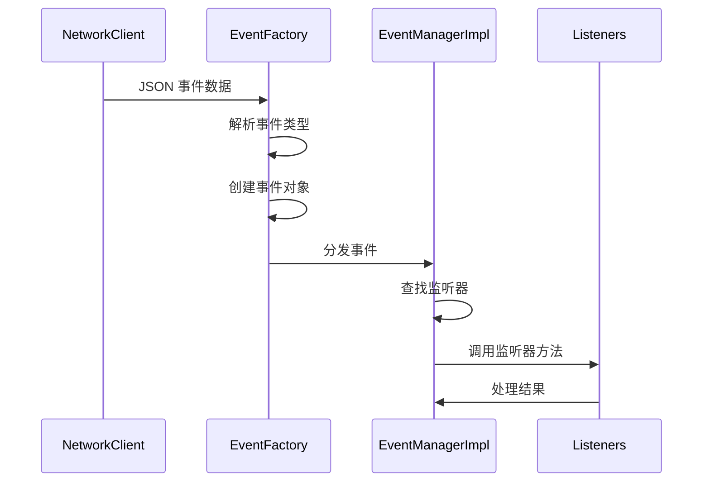

# 事件系统模块文档

> 📍 **导航路径**: [KookBC 根目录](../../../../../../../../CLAUDE.md) → [核心实现](../CLAUDE.md) → **事件系统**

## 模块概述

事件系统模块 (`snw.kookbc.impl.event`) 是 KookBC 的核心组件之一，负责处理来自 Kook 平台的所有事件，包括消息、用户状态变化、服务器操作等。该模块实现了高效的事件分发机制，确保事件按正确顺序处理且不重复。

## 核心架构

### 📁 模块结构

```
src/main/java/snw/kookbc/impl/event/
├── EventExecutorFactoryImpl.java      # 事件执行器工厂实现
├── EventFactory.java                  # 事件对象工厂 - 核心创建逻辑
├── EventManagerImpl.java              # 事件管理器 - 注册与分发
├── EventType.java                     # 事件类型枚举定义
├── EventTypeMap.java                  # 事件类型映射表
├── MethodScannerImpl.java             # 方法扫描器 - 注解处理
└── internal/                          # 内部事件监听器
    ├── InternalListener.java          # 系统内部监听器
    └── UserClickButtonListener.java   # 用户按钮点击监听器
```

## 核心组件详解

### 🏭 EventFactory.java
**职责**: 事件对象创建工厂
- 根据网络数据创建对应的事件对象
- 处理 JSON 数据到事件对象的转换
- 支持所有 JKook API 定义的事件类型

**关键方法**:
```java
public Event getEvent(JsonObject object)  // 主要事件创建入口
```

### 🎯 EventManagerImpl.java
**职责**: 事件注册与分发管理
- 实现 JKook API 的 EventManager 接口
- 维护事件监听器注册表
- 处理事件的异步分发

**核心功能**:
- 监听器注册: `registerListener(Listener, Plugin)`
- 事件调用: `callEvent(Event)`
- 线程安全的事件分发机制

### 🗺️ EventTypeMap.java
**职责**: 事件类型映射管理
- 维护事件类型字符串到枚举的映射
- 处理 Kook API 事件类型与 JKook 事件的对应关系
- 支持动态事件类型扩展

### 🔍 MethodScannerImpl.java
**职责**: 注解方法扫描器
- 扫描插件类中的 `@EventHandler` 方法
- 构建方法调用映射表
- 支持事件优先级处理

## 事件处理流程

### 📥 事件接收流程



### 🎭 支持的事件类型

根据 `EventType.java` 枚举，支持以下主要事件：
- **消息事件**: 文本消息、图片消息、语音消息等
- **用户事件**: 用户加入/离开、状态变更等
- **服务器事件**: 服务器信息更新、权限变更等
- **频道事件**: 频道创建/删除、权限修改等
- **交互事件**: 按钮点击、卡片操作等

## 重要特性

### 🔒 线程安全
- 事件分发采用线程安全机制
- 监听器注册表使用并发安全的数据结构
- 避免事件处理过程中的竞态条件

### 📊 顺序保证
- 支持 SN (Sequence Number) 顺序检查
- 确保消息按发送顺序处理
- 防止重复事件处理

### ⚡ 异步处理
- 事件分发采用异步机制
- 不会阻塞网络接收线程
- 支持事件处理优先级

## 使用示例

### 插件事件监听

```java
public class MyEventListener implements Listener {

    @EventHandler
    public void onUserMessage(UserMessageReceiveEvent event) {
        String content = event.getMessage().getComponent().toString();
        User sender = event.getUser();
        // 处理消息事件
    }

    @EventHandler(priority = EventPriority.HIGH)
    public void onUserJoin(UserJoinGuildEvent event) {
        // 高优先级处理用户加入事件
    }
}

// 注册监听器
plugin.getCore().getEventManager().registerListener(new MyEventListener(), plugin);
```

## 配置与扩展

### 内部监听器
- `InternalListener`: 处理系统级事件
- `UserClickButtonListener`: 专门处理按钮交互事件

### 扩展点
1. **自定义事件类型**: 通过扩展 `EventType` 支持新事件
2. **监听器优先级**: 使用 `EventPriority` 控制处理顺序
3. **事件过滤**: 在监听器中实现事件过滤逻辑

## 性能优化建议

### 🚀 最佳实践
1. **异步处理**: 耗时操作放入异步线程
2. **事件过滤**: 尽早过滤不需要的事件
3. **资源释放**: 及时清理监听器引用
4. **批量处理**: 对于高频事件考虑批量处理

### ⚠️ 注意事项
- 避免在事件处理中进行同步网络请求
- 事件监听器应该快速返回，避免阻塞
- 注意事件对象的生命周期管理
- 谨慎使用高优先级监听器

## 故障排查

### 常见问题
1. **事件未触发**: 检查监听器注册和事件类型匹配
2. **重复处理**: 检查 SN 顺序处理逻辑
3. **性能问题**: 分析事件处理耗时和频率
4. **内存泄漏**: 检查监听器的注销机制

### 调试工具
- 启用详细事件日志: `log4j2.xml` 中设置事件包日志级别
- 使用内置的事件统计功能
- 监控事件处理线程池状态

---

📝 **最后更新**: 2025-09-23 | 📖 **相关文档**: [网络通信模块](../network/CLAUDE.md) | [插件系统模块](../plugin/CLAUDE.md)