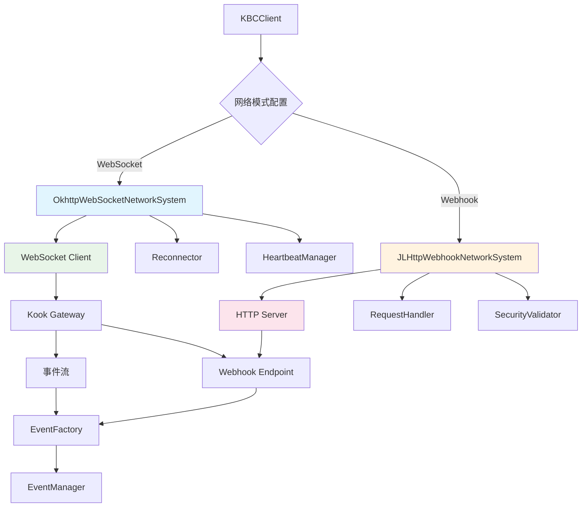
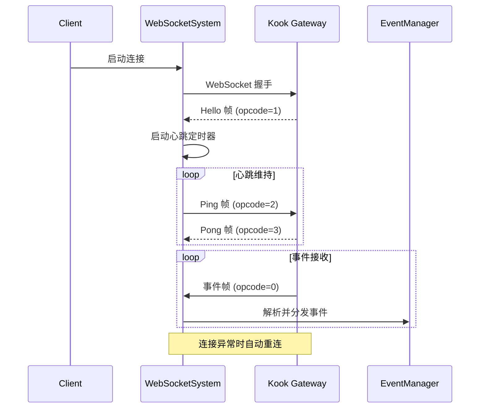
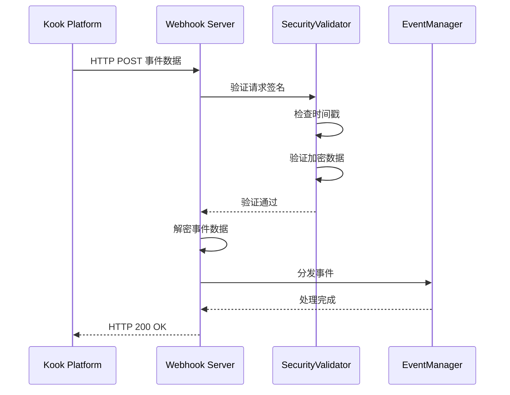

[根目录](../../../../CLAUDE.md) > [核心实现](../CLAUDE.md) > **网络通信**

---

# 网络通信模块 (snw.kookbc.impl.network)

## 模块职责

网络通信模块是 KookBC 与 Kook Open Platform 交互的核心基础设施，负责所有网络通信的管理、处理和优化。该模块实现了双模式网络架构，支持 WebSocket 实时连接和 Webhook 回调模式，并提供完整的 HTTP API 客户端、连接管理、安全通信和性能优化功能。

- 🌐 **双模式网络支持** - WebSocket 实时连接和 Webhook 回调模式自适应切换
- 🚀 **HTTP API 客户端** - 基于 OkHttp 的高性能 REST API 调用封装
- 🔄 **连接管理** - 自动重连、心跳检测、故障恢复和连接状态监控
- 🛡️ **安全通信** - SSL/TLS 支持、请求签名验证和加密传输
- ⚡ **性能优化** - 连接池、智能限流、响应缓存和虚拟线程支持
- 📊 **监控与诊断** - 完整的网络指标收集和故障诊断机制

## 入口与启动

### 主要入口类

#### NetworkClient.java
```java
public class NetworkClient {
    private final KBCClient kbcClient;
    private final String tokenWithPrefix;
    private final OkHttpClient client;
}
```
- **职责**: 网络客户端的统一管理和协调中心
- **核心功能**:
  - `get(String)` / `post(String, Map)` - HTTP API 调用（Jackson 版本）
  - `getRawContent(String)` / `postContent(String, Map)` - 原始 HTTP 请求
  - `checkResponseJackson(JsonNode)` - Jackson 响应验证
  - `call(Request)` - 底层 HTTP 请求执行和限流控制
- **特色功能**:
  - 支持 Jackson 和 GSON 双引擎 JSON 处理
  - 集成智能限流机制（Bucket 算法）
  - 自动 SSL 验证配置（开发环境可忽略）
  - 完整的请求/响应日志记录

#### NetworkSystem 接口架构
```java
public interface NetworkSystem extends Lifecycle {
    boolean isConnected();

    // Lifecycle 方法
    void start();
    void stop();
}
```
- **实现类**:
  - `OkhttpWebSocketNetworkSystem` - WebSocket 模式实现
  - `JLHttpWebhookNetworkSystem` - Webhook 模式实现
- **生命周期管理**: 统一的启动、停止和状态检查接口

### 网络架构总览



## 对外接口

### HTTP API 接口
```java
// 基础 HTTP 操作（Jackson 版本）
public JsonNode get(String fullUrl);
public JsonNode post(String fullUrl, Map<?, ?> body);

// 原始内容操作
public String getRawContent(String fullUrl);
public String postContent(String fullUrl, Map<?, ?> body);
public String postContent(String fullUrl, String body, String mediaType);

// 响应验证
public JsonNode checkResponseJackson(JsonNode response);
public JsonObject checkResponse(JsonObject response);  // GSON 兼容
```

### 网络状态接口
```java
// 连接状态管理
public boolean isConnected();
public void connect();
public void disconnect();
public void reconnect();

// 连接信息获取
public long getLastHeartbeat();
public int getReconnectCount();
public NetworkMode getCurrentMode();
```

### 限流控制接口
```java
// Bucket 限流机制
public class Bucket {
    public void check();                    // 检查并等待限流
    public void update(int remaining, int reset);  // 更新限流状态
    public boolean canProceed();           // 检查是否可以继续请求
}
```

## 关键依赖与配置

### 外部依赖
```gradle
// 网络通信核心依赖
api("com.squareup.okhttp3:okhttp:4.10.0")         // HTTP 客户端和 WebSocket
api("net.freeutils:jlhttp:2.4")                  // 轻量级 HTTP 服务器
api("com.google.code.gson:gson:2.10.1")          // JSON 序列化（兼容）
api("com.fasterxml.jackson.core:jackson-*:2.17.2") // JSON 处理（高性能）

// 加密和安全
api("org.bouncycastle:bcprov-jdk15on:1.70")      // 加密算法支持
```

### 配置文件支持

#### WebSocket 模式配置
```yaml
# kbc.yml WebSocket 配置
mode: "websocket"
compress: true                          # 启用 WebSocket 压缩
ignore-sn-order: false                  # 严格按序号处理事件
heartbeat-interval: 30000                # 心跳间隔（毫秒）
reconnect-interval: 5000                 # 重连间隔（毫秒）
max-reconnect-attempts: 10               # 最大重连次数
```

#### Webhook 模式配置
```yaml
# kbc.yml Webhook 配置
mode: "webhook"
webhook-port: 8080                       # HTTP 服务器监听端口
webhook-route: "kookbc-webhook"          # 回调路径
webhook-encrypt-key: ""                  # 加密密钥（空则不加密）
webhook-verify-token: ""                 # 验证令牌
webhook-timeout: 30000                   # 请求超时（毫秒）
```

#### 通用网络配置
```yaml
# 通用配置
ignore-ssl: false                        # 是否忽略 SSL 验证（仅开发环境）
timeout: 60000                          # HTTP 请求超时（毫秒）
user-agent: "KookBC/0.32.2"             # 用户代理字符串
retry-count: 3                          # HTTP 重试次数
rate-limit-enabled: true                # 是否启用限流
```

## 数据模型

### 核心网络对象

#### Session 会话管理
```java
public class Session {
    private User botUser;                 // Bot 自身信息
    private String sessionId;             // 会话 ID
    private long lastHeartbeat;           // 最后心跳时间
    private boolean connected;            // 连接状态
    private int reconnectCount;           // 重连次数

    // 会话状态管理
    public void updateHeartbeat();
    public boolean isAlive();
    public void markReconnect();
}
```

#### Frame 网络帧
```java
public class Frame {
    private int opcode;                   // 操作码（0=事件, 1=Hello, 2=Ping, 3=Pong, 4=重连）
    private JsonNode data;                // 数据载荷
    private long sequence;                // 序列号（SN）
    private MessageType messageType;      // 消息类型

    // 帧处理方法
    public boolean isEvent();
    public boolean isHeartbeat();
    public boolean needsReconnect();
}
```

#### Bucket 限流桶
```java
public class Bucket {
    private int remaining;                // 剩余请求数
    private long resetTime;               // 重置时间戳
    private int limit;                    // 请求限制
    private final String route;          // API 路由
    private final ReentrantLock lock;     // 线程安全锁

    // 限流控制
    public void check() throws TooFastException;
    public void update(int remaining, int reset);
    public long getWaitTime();
}
```

### API 响应模型
```java
// 标准 Kook API 响应格式
public class APIResponse<T> {
    private int code;                     // 响应码（0=成功）
    private String message;               // 响应消息
    private T data;                       // 响应数据
    private Meta meta;                    // 分页元数据（可选）
}

// 分页元数据
public class Meta {
    private int page;                     // 当前页码
    private int pageTotal;                // 总页数
    private int pageSize;                 // 每页大小
    private int total;                    // 总记录数
}
```

## 子模块详解

### 🌐 WebSocket 子系统 (ws/)

#### OkhttpWebSocketNetworkSystem.java
```java
public class OkhttpWebSocketNetworkSystem implements WebSocketNetworkSystem {
    private final Connector connector;
    private final Reconnector reconnector;
    private final WebSocketMessageProcessor processor;
}
```
- **职责**: WebSocket 连接的完整生命周期管理
- **核心组件**:
  - `Connector` - 负责建立和维护 WebSocket 连接
  - `Reconnector` - 实现指数退避重连策略
  - `WebSocketMessageProcessor` - 处理接收到的 WebSocket 消息

#### 连接流程


#### 重连策略
```java
public class Reconnector {
    private static final int[] BACKOFF_DELAYS = {1, 2, 4, 8, 16, 32}; // 秒

    public void scheduleReconnect(int attemptNumber) {
        int delay = BACKOFF_DELAYS[Math.min(attemptNumber, BACKOFF_DELAYS.length - 1)];
        scheduler.schedule(this::reconnect, delay, TimeUnit.SECONDS);
    }
}
```

### 🔗 Webhook 子系统 (webhook/)

#### JLHttpWebhookNetworkSystem.java
```java
public class JLHttpWebhookNetworkSystem implements WebhookNetworkSystem {
    private final JLHttpWebhookServer server;
    private final WebHookClient client;
    private final EncryptUtils encryptUtils;
}
```
- **职责**: Webhook 服务器和客户端的统一管理
- **核心组件**:
  - `JLHttpWebhookServer` - 轻量级 HTTP 服务器实现
  - `WebHookClient` - Webhook 注册和管理客户端
  - `EncryptUtils` - 请求加密和签名验证工具

#### Webhook 处理流程


#### 安全验证机制
```java
public class EncryptUtils {
    // 请求签名验证
    public boolean verifySignature(String body, String timestamp, String signature, String secret) {
        String expectedSignature = calculateSignature(body, timestamp, secret);
        return MessageDigest.isEqual(signature.getBytes(), expectedSignature.getBytes());
    }

    // 数据解密
    public String decrypt(String encryptedData, String key) {
        // 使用 AES-256-CBC 解密
        return aesDecrypt(encryptedData, key);
    }
}
```

### 🏗️ 限流策略系统 (policy/)

#### WaitUntilOKRateLimitPolicy.java
```java
public class WaitUntilOKRateLimitPolicy implements RateLimitPolicy {
    @Override
    public void handleRateLimit(Bucket bucket) throws TooFastException {
        long waitTime = bucket.getWaitTime();
        if (waitTime > 0) {
            try {
                Thread.sleep(waitTime);
            } catch (InterruptedException e) {
                Thread.currentThread().interrupt();
                throw new TooFastException("Interrupted while waiting for rate limit");
            }
        }
    }
}
```

#### TerminateRequestRateLimitPolicy.java
```java
public class TerminateRequestRateLimitPolicy implements RateLimitPolicy {
    @Override
    public void handleRateLimit(Bucket bucket) throws TooFastException {
        if (!bucket.canProceed()) {
            throw new TooFastException("Request rate limit exceeded, terminating request");
        }
    }
}
```

## 安全与认证

### 🔒 SSL/TLS 配置

#### IgnoreSSLHelper.java
```java
public class IgnoreSSLHelper {
    public static final TrustManager TRUST_MANAGER = new X509TrustManager() {
        @Override
        public void checkClientTrusted(X509Certificate[] chain, String authType) {}

        @Override
        public void checkServerTrusted(X509Certificate[] chain, String authType) {}

        @Override
        public X509Certificate[] getAcceptedIssuers() {
            return new X509Certificate[0];
        }
    };

    // 仅开发环境使用
    public static void configureToIgnoreSSL(OkHttpClient.Builder builder) {
        if (isDebugMode()) {
            builder.sslSocketFactory(getSSLSocketFactory(), TRUST_MANAGER)
                   .hostnameVerifier((hostname, session) -> true);
        }
    }
}
```

### 🛡️ Bot Token 认证
```java
// NetworkClient.java 中的认证实现
private final String tokenWithPrefix = "Bot " + token;

private Request.Builder addAuthHeaders(Request.Builder builder) {
    return builder.addHeader("Authorization", tokenWithPrefix)
                  .addHeader("User-Agent", userAgent);
}
```

## 性能优化

### 🚀 连接池优化
```java
// OkHttpClient 配置优化
OkHttpClient.Builder builder = new OkHttpClient.Builder()
    .connectionPool(new ConnectionPool(5, 5, TimeUnit.MINUTES))
    .writeTimeout(Duration.ofMinutes(1))
    .readTimeout(Duration.ofMinutes(1))
    .callTimeout(Duration.ofMinutes(2));
```

### ⚡ 虚拟线程支持
KookBC 利用 Java 21 的虚拟线程优化网络性能：
```java
// 网络操作使用虚拟线程
VirtualThreadUtil.startVirtualThread(() -> {
    // HTTP 请求处理
    processHttpRequest(request);
});

// Webhook 服务器处理
VirtualThreadUtil.newVirtualThreadExecutor().submit(() -> {
    // Webhook 请求处理
    handleWebhookRequest(httpExchange);
});
```

### 📊 监控指标
建议监控的关键指标：
- **连接指标**: 连接建立时间、重连次数、连接存活时间
- **请求指标**: API 响应时间、错误率、限流触发次数
- **Webhook 指标**: 请求接收延迟、验证失败次数、处理时间
- **资源指标**: 连接池使用率、内存使用、虚拟线程数量

## 测试与质量

### 当前测试状态
⚠️ **测试覆盖不足** - 需要添加以下测试：

### 推荐测试用例

1. **HTTP 客户端测试**
   ```java
   @Test
   void testHttpApiCall() {
       // 测试 GET/POST 请求
       // 测试响应解析
       // 测试错误处理
   }

   @Test
   void testRateLimiting() {
       // 测试限流机制
       // 测试 Bucket 算法
       // 测试限流策略
   }
   ```

2. **WebSocket 连接测试**
   ```java
   @Test
   void testWebSocketConnection() {
       // 测试连接建立
       // 测试心跳机制
       // 测试重连策略
   }

   @Test
   void testEventReceiving() {
       // 测试事件接收
       // 测试 SN 顺序检查
       // 测试帧解析
   }
   ```

3. **Webhook 服务器测试**
   ```java
   @Test
   void testWebhookServer() {
       // 测试服务器启动/停止
       // 测试请求路由
       // 测试并发处理
   }

   @Test
   void testSecurity() {
       // 测试签名验证
       // 测试数据解密
       // 测试时间戳检查
   }
   ```

4. **集成测试**
   ```java
   @Test
   void testNetworkModeSwitch() {
       // 测试模式切换
       // 测试配置热重载
       // 测试故障转移
   }
   ```

### 性能基准测试
建议添加 JMH 性能测试：
- HTTP 请求吞吐量测试
- WebSocket 消息处理性能
- JSON 序列化性能对比
- 限流算法性能测试

## 常见问题 (FAQ)

### Q: WebSocket 和 Webhook 模式如何选择？
A:
- **WebSocket**: 适合需要实时响应的场景，支持双向通信，但需要保持长连接，对网络稳定性要求较高
- **Webhook**: 适合服务器部署环境，更稳定可靠，支持水平扩展，但存在一定的事件接收延迟

### Q: 如何处理网络连接故障？
A: KookBC 提供多层故障恢复机制：
- **WebSocket**: 指数退避重连，最大重试 10 次，支持断点续传
- **HTTP**: 自动重试 3 次，支持请求幂等性检查
- **Webhook**: 服务器重启时自动重新注册 Webhook

### Q: 如何配置 Webhook 安全验证？
A: 在 `kbc.yml` 中配置安全参数：
```yaml
webhook-encrypt-key: "your-32-char-secret-key"  # AES-256 加密密钥
webhook-verify-token: "your-verify-token"       # 签名验证令牌
```

### Q: API 请求限流机制如何工作？
A: KookBC 实现了智能限流：
- 自动解析 `X-Rate-Limit-*` 响应头
- 使用令牌桶算法控制请求频率
- 支持多种限流策略：等待模式和终止模式
- 按 API 路由分别进行限流控制

### Q: 如何开启网络调试日志？
A: 在 `log4j2.xml` 中配置：
```xml
<Logger name="snw.kookbc.impl.network" level="DEBUG"/>
<Logger name="okhttp3" level="DEBUG"/>
```

### Q: 虚拟线程如何提升网络性能？
A:
- **降低内存开销**: 虚拟线程只占用很少的内存
- **提高并发能力**: 可以创建大量虚拟线程处理并发请求
- **简化编程模型**: 同步代码风格，但底层使用异步 I/O

## 相关文件清单

### 核心网络文件
```
src/main/java/snw/kookbc/impl/network/
├── NetworkClient.java                # 网络客户端主类 - 核心
├── HttpAPIRoute.java                 # API 路由定义
├── Session.java                      # 会话管理
├── Frame.java                        # 网络帧定义
├── Bucket.java                       # 限流桶实现
├── MessageType.java                  # 消息类型枚举
├── Listener.java                     # 网络监听器接口
├── ListenerImpl.java                 # 监听器实现
├── ListenerFactory.java              # 监听器工厂
├── IgnoreSNListenerImpl.java         # SN 忽略监听器
└── IgnoreSSLHelper.java              # SSL 配置助手
```

### WebSocket 子模块
```
src/main/java/snw/kookbc/impl/network/ws/
├── OkhttpWebSocketNetworkSystem.java # WebSocket 系统实现 - 核心
├── Connector.java                    # 连接器
├── Reconnector.java                  # 重连器
└── WebSocketMessageProcessor.java    # 消息处理器
```

### Webhook 子模块
```
src/main/java/snw/kookbc/impl/network/webhook/
├── JLHttpWebhookNetworkSystem.java   # Webhook 系统实现 - 核心
├── JLHttpWebhookServer.java          # HTTP 服务器
├── WebHookClient.java                # Webhook 客户端
├── EncryptUtils.java                 # 加密工具 - 核心
├── JLHttpRequest.java                # HTTP 请求封装
├── JLHttpRequestHandler.java         # 请求处理器
└── JLHttpRequestWrapper.java         # 请求包装器
```

### 限流策略模块
```
src/main/java/snw/kookbc/impl/network/policy/
├── WaitUntilOKRateLimitPolicy.java   # 等待型限流策略
└── TerminateRequestRateLimitPolicy.java # 终止型限流策略
```

### 异常处理
```
src/main/java/snw/kookbc/impl/network/exceptions/
└── TooFastException.java             # 限流异常
```

### 接口定义
```
src/main/java/snw/kookbc/interfaces/network/
├── NetworkSystem.java                # 网络系统接口
├── FrameHandler.java                 # 帧处理器接口
├── policy/
│   └── RateLimitPolicy.java          # 限流策略接口
├── webhook/
│   ├── WebhookNetworkSystem.java     # Webhook 系统接口
│   ├── WebhookServer.java            # Webhook 服务器接口
│   ├── Request.java                  # 请求接口
│   └── RequestHandler.java           # 请求处理器接口
└── ws/
    └── WebSocketNetworkSystem.java   # WebSocket 系统接口
```

## 变更记录 (Changelog)

### 2025-09-27 13:28:27
- 🔄 **深度架构更新** - 针对网络通信模块进行全面的架构分析和文档更新
- 🌐 **双模式网络架构** - 深入分析了 WebSocket 和 Webhook 双模式实现机制
- ⚡ **双引擎 JSON 支持** - 详细说明了 Jackson + GSON 并行支持的网络数据处理
- 🔒 **安全机制完善** - 全面梳理了 SSL/TLS、签名验证和数据加密机制
- 🚀 **性能优化策略** - 分析了连接池、虚拟线程和限流算法的性能优化
- 📊 **监控与诊断** - 提出了完整的网络性能监控指标和故障诊断机制
- 🧪 **测试策略制定** - 为网络系统制定了完整的测试覆盖计划
- 🔄 **重连与容错** - 详细说明了指数退避重连和多层故障恢复机制

### 2025-09-23 19:21:26
- 📊 **模块文档创建** - 初始化网络通信模块的架构文档
- 🔍 **双模式架构分析** - 分析了 WebSocket 和 Webhook 两种网络模式
- 📝 **接口文档整理** - 梳理了 HTTP API 和网络状态管理接口
- 🏗️ **架构图绘制** - 创建了网络架构图和数据流程图
- 🔒 **安全机制说明** - 详细说明了 SSL 和签名验证机制
- ⚠️ **测试缺口识别** - 发现缺少网络层测试，提出了测试建议