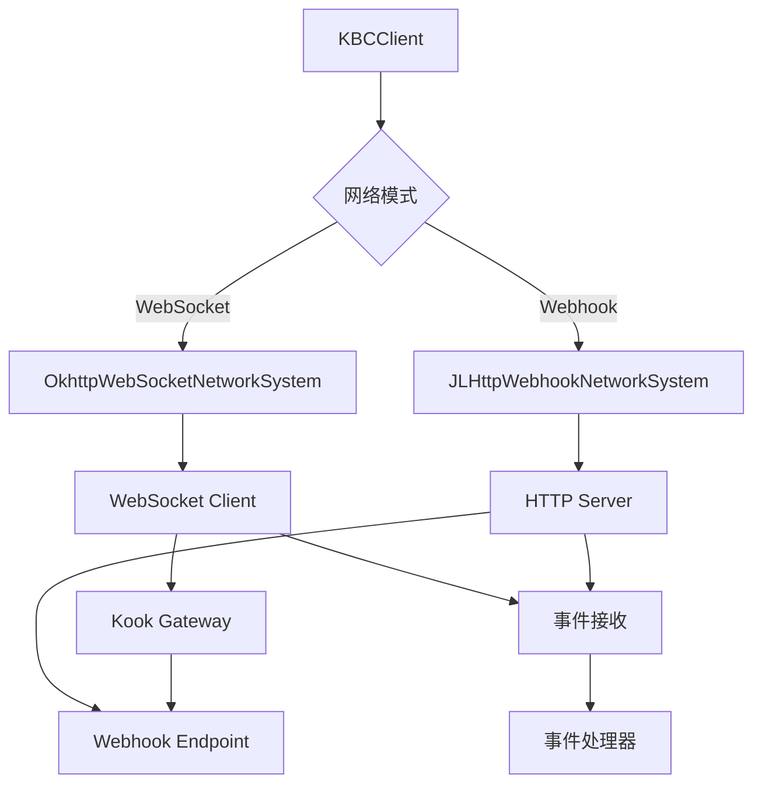
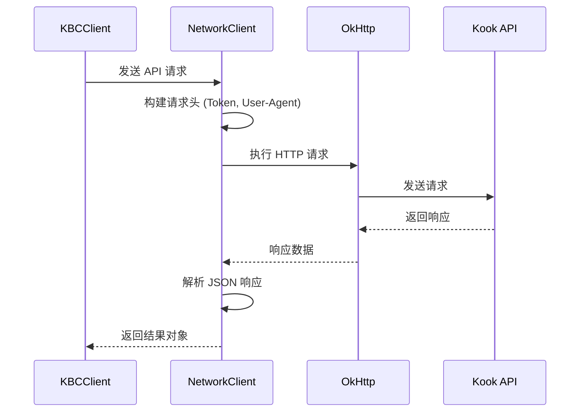

[根目录](../../../../CLAUDE.md) > [src](../../../) > [main](../../) > [java](../) > [snw.kookbc.impl](./) > **network**

---

# 网络通信模块 (snw.kookbc.impl.network)

## 模块职责

网络通信模块是 KookBC 与 Kook Open Platform 交互的核心组件，负责所有网络通信的管理和处理。该模块提供了：

- 🌐 **双模式网络支持** - WebSocket 实时连接和 Webhook 回调模式
- 🚀 **HTTP API 客户端** - 完整的 REST API 调用封装
- 🔄 **连接管理** - 自动重连、心跳检测和故障恢复
- 🛡️ **安全通信** - SSL/TLS 支持和请求签名验证
- ⚡ **性能优化** - 连接池、请求限流和缓存机制

## 入口与启动

### 主要入口类

#### NetworkClient.java
```java
public class NetworkClient
```
- **职责**: 网络客户端的统一管理和协调
- **功能**:
  - HTTP 请求发送和响应处理
  - 网络连接状态管理
  - 错误重试和故障恢复

#### HttpAPIRoute.java
```java
public class HttpAPIRoute
```
- **职责**: HTTP API 路由定义和路径管理
- **功能**:
  - API 端点定义
  - 请求路径构建
  - 参数序列化

### 网络系统抽象
```java
public interface NetworkSystem {
    void connect();
    void disconnect();
    boolean isConnected();
}
```

## 对外接口

### HTTP API 接口
```java
// 基础 HTTP 操作
public <T> T get(String endpoint, Class<T> responseType)
public <T> T post(String endpoint, Object body, Class<T> responseType)
public <T> T put(String endpoint, Object body, Class<T> responseType)
public void delete(String endpoint)
```

### 网络事件接口
- **连接事件**: 连接建立、断开、重连
- **消息事件**: 接收到的事件消息
- **错误事件**: 网络错误和异常处理

## 关键依赖与配置

### 外部依赖
```gradle
// 网络通信核心依赖
api("com.squareup.okhttp3:okhttp")        // HTTP 客户端
api("net.freeutils:jlhttp")               // Webhook HTTP 服务器
api("com.google.code.gson:gson")          // JSON 序列化
```

### WebSocket 模式配置
```yaml
# WebSocket 连接配置
mode: "websocket"
compress: true                 # 启用压缩
ignore-sn-order: false        # 严格按序号处理事件
```

### Webhook 模式配置
```yaml
# Webhook 服务器配置
mode: "webhook"
webhook-port: 8080             # 监听端口
webhook-route: "kookbc-webhook" # 回调路径
webhook-encrypt-key: ""        # 加密密钥
webhook-verify-token: ""       # 验证令牌
```

## 网络架构设计

### 双模式架构


### 请求流程图


## 数据模型

### 核心网络对象
```java
// 会话管理
public class Session {
    private User botUser;           // Bot 自身信息
    private String sessionId;       // 会话 ID
    private long lastHeartbeat;     // 最后心跳时间
}

// 网络帧
public class Frame {
    private int opcode;             // 操作码
    private JsonObject data;        // 数据载荷
    private long sequence;          // 序列号
}

// 请求桶 (限流)
public class Bucket {
    private int remaining;          // 剩余请求数
    private long resetTime;         // 重置时间
    private int limit;             // 限制数量
}
```

### API 响应模型
```java
// 标准 API 响应
public class APIResponse<T> {
    private int code;               // 响应码
    private String message;         // 响应消息
    private T data;                // 响应数据
}
```

## 子模块说明

### WebSocket 子模块 (ws/)
- **OkhttpWebSocketNetworkSystem**: WebSocket 连接管理
- **WebSocketListener**: WebSocket 事件监听
- **HeartbeatManager**: 心跳维持
- **ReconnectHandler**: 重连策略

### Webhook 子模块 (webhook/)
- **JLHttpWebhookNetworkSystem**: HTTP 服务器实现
- **WebhookHandler**: Webhook 请求处理
- **SecurityValidator**: 签名验证
- **EventDecryptor**: 事件解密

### 安全与验证
```java
// SSL 验证忽略 (仅开发环境)
public class IgnoreSSLHelper {
    public static void configureToIgnoreSSL(OkHttpClient.Builder builder)
}

// 签名验证
public class SignatureValidator {
    public boolean validate(String payload, String signature, String secret)
}
```

## 测试与质量

### 当前测试覆盖
❌ **缺少测试** - 建议添加以下测试：

### 建议测试用例
1. **HTTP 客户端测试**
   - API 请求/响应正确性
   - 错误码处理
   - 限流机制测试

2. **WebSocket 连接测试**
   - 连接建立和断开
   - 心跳机制
   - 重连策略

3. **Webhook 服务器测试**
   - HTTP 服务器启动/停止
   - 请求路由和处理
   - 签名验证

### 性能指标
- **连接延迟**: < 100ms (WebSocket 握手)
- **API 响应**: < 500ms (平均响应时间)
- **并发连接**: 支持 1000+ 并发 Webhook 请求
- **内存使用**: < 50MB (网络缓冲区)

## 常见问题 (FAQ)

### Q: WebSocket 和 Webhook 模式如何选择？
A:
- **WebSocket**: 适合实时性要求高的场景，支持双向通信，但需要保持长连接
- **Webhook**: 适合服务器部署，更稳定可靠，但存在一定延迟

### Q: 如何处理网络连接故障？
A: KookBC 内置了完善的重连机制：
- WebSocket: 指数退避重连，最大重试 10 次
- HTTP: 自动重试 3 次，支持请求幂等性检查

### Q: 如何配置 Webhook 安全验证？
A: 在 `kbc.yml` 中配置：
```yaml
webhook-encrypt-key: "your-encrypt-key"
webhook-verify-token: "your-verify-token"
```

### Q: API 请求限流如何处理？
A: KookBC 实现了智能限流：
- 自动检测 `X-Rate-Limit-*` 响应头
- 使用令牌桶算法控制请求频率
- 超限时自动延迟等待

## 相关文件清单

### 核心网络文件
```
src/main/java/snw/kookbc/impl/network/
├── NetworkClient.java          # 网络客户端主类
├── HttpAPIRoute.java           # API 路由定义
├── Session.java                # 会话管理
├── Frame.java                  # 网络帧定义
├── Bucket.java                 # 限流桶
├── IgnoreSSLHelper.java        # SSL 配置
└── ListenerFactory.java        # 监听器工厂
```

### WebSocket 子模块
```
src/main/java/snw/kookbc/impl/network/ws/
├── OkhttpWebSocketNetworkSystem.java  # WebSocket 实现
├── WebSocketListener.java             # 事件监听器
├── HeartbeatManager.java              # 心跳管理
└── ReconnectHandler.java              # 重连处理
```

### Webhook 子模块
```
src/main/java/snw/kookbc/impl/network/webhook/
├── JLHttpWebhookNetworkSystem.java    # Webhook 服务器
├── WebhookHandler.java                # 请求处理器
├── SecurityValidator.java             # 安全验证
└── EventDecryptor.java                # 事件解密
```

## 变更记录 (Changelog)

### 2025-09-23 19:21:26
- 📊 **模块文档创建** - 初始化网络通信模块的架构文档
- 🔍 **架构分析完成** - 分析了双模式网络架构和核心组件
- 📝 **接口文档整理** - 梳理了 HTTP API 和网络事件接口
- 🏗️ **架构图绘制** - 创建了网络架构图和请求流程图
- 🔒 **安全机制说明** - 详细说明了 SSL 和签名验证机制
- ⚠️ **测试缺口识别** - 发现缺少网络层测试，提出了测试建议