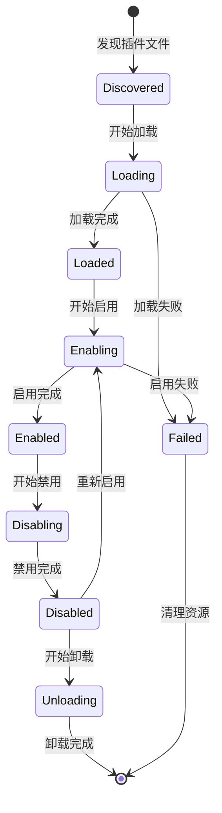

# 插件系统模块文档

> 📍 **导航路径**: [KookBC 根目录](../../../../../../../../CLAUDE.md) → [核心实现](../CLAUDE.md) → **插件系统**

## 模块概述

插件系统模块 (`snw.kookbc.impl.plugin`) 是 KookBC 的核心组件，提供完整的插件生命周期管理。该模块实现了基于 ClassLoader 隔离的插件架构，支持热插拔、依赖管理和 Mixin 字节码增强功能。

## 核心架构

### 📁 模块结构

```
src/main/java/snw/kookbc/impl/plugin/
├── SimplePluginManager.java          # 插件管理器 - 核心组件
├── SimplePluginClassLoader.java      # 插件类加载器 - 隔离机制
├── PluginClassLoaderDelegate.java    # 类加载器委托
├── MixinPluginManager.java           # Mixin 插件支持
├── InternalPlugin.java               # 内置插件实现
└── PrefixLogger.java                 # 插件专用日志器
```

## 核心组件详解

### 🎯 SimplePluginManager.java
**职责**: 插件生命周期管理
- 插件的加载、启用、禁用、卸载
- 插件依赖关系解析
- 插件状态监控和异常处理

**核心功能**:
```java
// 插件生命周期管理
public void loadPlugin(File pluginFile)
public void enablePlugin(Plugin plugin)
public void disablePlugin(Plugin plugin)
public void unloadPlugin(Plugin plugin)

// 插件查找和获取
public Plugin getPlugin(String name)
public Collection<Plugin> getPlugins()
public boolean isPluginEnabled(String name)
```

### 🔒 SimplePluginClassLoader.java
**职责**: 插件类隔离加载器
- 为每个插件创建独立的类加载空间
- 防止插件间的类冲突
- 支持插件依赖的动态加载

**隔离特性**:
- **独立命名空间**: 每个插件有自己的类加载器
- **父委托模式**: 优先加载 JKook API 和系统类
- **插件间通信**: 通过 JKook API 接口进行交互
- **资源隔离**: 插件资源文件独立管理

### 🧬 MixinPluginManager.java
**职责**: Mixin 字节码增强支持
- 管理 Mixin 插件的特殊加载需求
- 处理字节码转换和类增强
- 与 SpongePowered Mixin 框架集成

**Mixin 功能**:
- 字节码注入支持
- 运行时类修改
- AOP (面向切面编程) 支持
- 高级插件开发能力

### 📝 PrefixLogger.java
**职责**: 插件专用日志系统
- 为每个插件提供独立的日志前缀
- 日志级别控制和格式化
- 与主系统日志集成

## 插件生命周期

### 🔄 完整生命周期



### 📋 生命周期详解

1. **发现阶段**: 扫描插件目录，识别 JAR 文件
2. **加载阶段**:
   - 创建 ClassLoader
   - 解析 plugin.yml
   - 验证插件信息
3. **启用阶段**:
   - 调用 `onLoad()` 方法
   - 注册事件监听器
   - 注册命令处理器
   - 调用 `onEnable()` 方法
4. **运行阶段**: 插件正常工作
5. **禁用阶段**:
   - 调用 `onDisable()` 方法
   - 注销事件监听器
   - 清理资源
6. **卸载阶段**: 清理 ClassLoader 和相关引用

## 插件配置系统

### 📄 plugin.yml 格式

```yaml
# 基本信息
name: MyPlugin
version: 1.0.0
main: com.example.MyPlugin
description: "我的第一个 Kook 插件"
author: "开发者"
website: "https://example.com"

# 依赖管理
api-version: "0.32.0"
depend: ["RequiredPlugin"]
soft-depend: ["OptionalPlugin"]
load-before: ["OtherPlugin"]

# 权限定义
permissions:
  myplugin.admin:
    description: "管理员权限"
    default: op
  myplugin.use:
    description: "使用权限"
    default: true

# 命令定义
commands:
  mycommand:
    description: "我的命令"
    usage: "/mycommand <参数>"
    permission: myplugin.use
```

### 🔧 InternalPlugin.java
**内置插件功能**:
- 系统核心功能封装
- 内置命令实现
- 系统级事件处理

## 类加载机制

### 🏗️ 类加载策略

```java
// 类加载优先级
1. JKook API 类 (共享)
2. 系统核心类 (共享)
3. 插件依赖类 (隔离)
4. 插件自身类 (隔离)
```

### 🔗 PluginClassLoaderDelegate.java
**委托模式实现**:
- 统一类加载入口
- 处理类加载冲突
- 支持动态类路径

## 插件通信机制

### 🌉 插件间通信

1. **事件系统**: 通过事件进行松耦合通信
2. **服务提供**: 通过 JKook API 提供服务接口
3. **共享数据**: 通过持久化存储共享数据
4. **消息传递**: 通过插件消息通道

### 📡 API 集成

```java
// 获取其他插件
Plugin otherPlugin = getServer().getPluginManager().getPlugin("OtherPlugin");

// 检查插件状态
if (otherPlugin != null && otherPlugin.isEnabled()) {
    // 与其他插件交互
}

// 触发自定义事件
MyCustomEvent event = new MyCustomEvent(data);
getServer().getPluginManager().callEvent(event);
```

## 开发示例

### 🔌 基础插件开发

```java
public class MyPlugin extends BasePlugin {

    @Override
    public void onLoad() {
        getLogger().info("插件加载中...");
        // 初始化配置、数据库连接等
    }

    @Override
    public void onEnable() {
        getLogger().info("插件启用中...");

        // 注册事件监听器
        getServer().getPluginManager().registerEvents(new MyListener(), this);

        // 注册命令
        getCommand("mycommand").setExecutor(new MyCommandExecutor());

        getLogger().info("插件启用完成！");
    }

    @Override
    public void onDisable() {
        getLogger().info("插件禁用中...");
        // 清理资源、保存数据等
    }
}
```

### 🎯 事件监听器

```java
public class MyListener implements Listener {

    @EventHandler
    public void onUserMessage(UserMessageReceiveEvent event) {
        String message = event.getMessage().getComponent().toString();
        if (message.startsWith("!hello")) {
            event.getChannel().sendMessage("Hello, " + event.getUser().getName() + "!");
        }
    }
}
```

### 💬 命令处理器

```java
public class MyCommandExecutor implements CommandExecutor {

    @Override
    public boolean onCommand(CommandSender sender, Command command, String label, String[] args) {
        if (args.length == 0) {
            sender.sendMessage("用法: /mycommand <参数>");
            return false;
        }

        // 处理命令逻辑
        sender.sendMessage("命令执行成功: " + String.join(" ", args));
        return true;
    }
}
```

## Mixin 高级功能

### 🧪 Mixin 配置

```json
{
  "required": true,
  "package": "com.example.mixins",
  "compatibilityLevel": "JAVA_8",
  "refmap": "mixin.refmap.json",
  "mixins": [
    "MixinMessageSender",
    "MixinEventProcessor"
  ],
  "client": [],
  "server": [],
  "minVersion": "0.8"
}
```

### 🔬 Mixin 示例

```java
@Mixin(UserImpl.class)
public class MixinUserImpl {

    @Inject(method = "sendPrivateMessage", at = @At("HEAD"))
    private void onSendMessage(String message, CallbackInfo ci) {
        // 在发送私聊消息前注入逻辑
        System.out.println("即将发送私聊消息: " + message);
    }
}
```

## 性能优化

### 🚀 最佳实践

1. **延迟初始化**: 按需加载资源
2. **缓存机制**: 缓存频繁访问的数据
3. **异步处理**: 耗时操作使用异步线程
4. **资源释放**: 及时释放不用的资源

### 📊 监控指标

- 插件加载时间
- 内存使用情况
- 事件处理性能
- 类加载统计

## 故障排查

### 🔍 常见问题

1. **ClassNotFoundException**: 检查依赖和类路径
2. **NoSuchMethodError**: 版本兼容性问题
3. **内存泄漏**: 检查事件监听器注销
4. **启动失败**: 检查 plugin.yml 配置

### 🛠️ 调试工具

- 启用插件调试日志
- 使用 JVM 内存分析工具
- 监控类加载器状态
- 检查插件依赖关系图

### 📋 健康检查

```java
// 插件状态检查
public boolean isHealthy() {
    return isEnabled() &&
           !hasErrors() &&
           getClassLoader() != null;
}
```

## 安全考虑

### 🔐 安全机制

1. **类加载隔离**: 防止恶意代码影响系统
2. **权限控制**: 限制插件访问敏感资源
3. **代码签名**: 验证插件来源
4. **沙箱模式**: 限制插件系统调用

### ⚠️ 安全建议

- 只安装来源可信的插件
- 定期更新插件版本
- 监控插件行为异常
- 备份重要数据

---

📝 **最后更新**: 2025-09-23 | 📖 **相关文档**: [命令系统模块](../command/CLAUDE.md) | [事件系统模块](../event/CLAUDE.md)