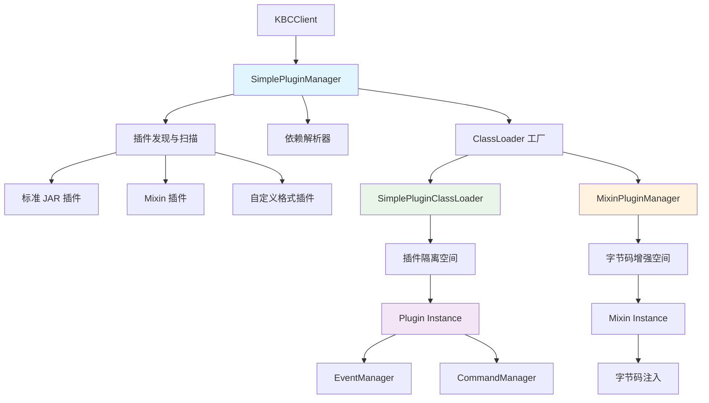
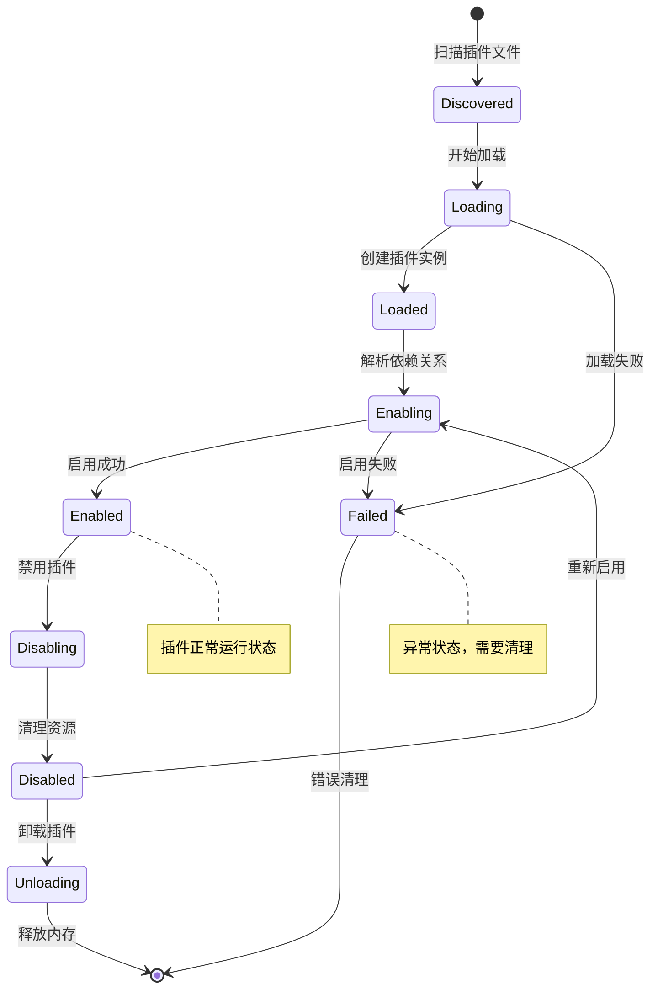

[根目录](../../../../CLAUDE.md) > [核心实现](../CLAUDE.md) > **插件系统**

---

# 插件系统模块 (snw.kookbc.impl.plugin)

## 模块职责

插件系统模块是 KookBC 的核心扩展机制，提供完整的插件生命周期管理和运行时环境。该模块实现了基于 ClassLoader 隔离的插件架构，支持热插拔、依赖管理、Mixin 字节码增强，并提供安全的插件间通信机制，确保插件生态的稳定性和可扩展性。

- 🎯 **插件管理器** - 完整的插件生命周期管理（加载、启用、禁用、卸载）
- 🔒 **类加载隔离** - 基于独立 ClassLoader 的插件隔离机制
- 🧬 **Mixin 字节码支持** - 集成 SpongePowered Mixin 框架的高级字节码操作
- 📋 **依赖解析** - 智能的插件依赖关系分析和加载顺序控制
- 🔌 **热插拔支持** - 运行时动态加载和卸载插件
- 🛡️ **安全隔离** - 插件间资源隔离和权限控制机制

## 入口与启动

### 主要入口类

#### SimplePluginManager.java
```java
public class SimplePluginManager implements PluginManager {
    private final Collection<Plugin> plugins = new ArrayList<>();
    private final Map<Predicate<File>, Function<ClassLoader, PluginLoader>> loaderMap;
    private final Map<Predicate<File>, Supplier<PluginDescriptionResolver>> pluginDescriptionResolverMap;
}
```
- **职责**: JKook PluginManager 接口的标准实现
- **核心功能**:
  - `loadPlugin(File)` / `loadPlugins(File)` - 插件加载和批量加载
  - `enablePlugin(Plugin)` / `disablePlugin(Plugin)` - 插件启用和禁用
  - `getPlugin(String)` / `getPlugins()` - 插件查询和管理
  - `registerPluginLoader()` - 注册自定义插件加载器
- **特色功能**:
  - 支持多种插件格式（JAR、目录、自定义格式）
  - 智能依赖顺序解析
  - 版本兼容性检查
  - 异常安全的插件操作

#### SimplePluginClassLoader.java
```java
public class SimplePluginClassLoader extends URLClassLoader implements MarkedClassLoader {
    private final KBCClient client;
    private final AccessClassLoader parent;
    private final PluginDescriptionResolver resolver;
}
```
- **职责**: 插件专用类加载器，提供完整的类隔离机制
- **核心特性**:
  - 独立的类命名空间
  - 父委托加载策略
  - 资源文件隔离
  - 插件间通信控制
- **安全机制**:
  - 只允许加载插件自身的类
  - 共享 JKook API 和系统核心类
  - 防止类冲突和版本冲突

### 插件架构总览



## 对外接口

### 插件管理接口
```java
// 插件生命周期管理
public Plugin loadPlugin(File file) throws InvalidPluginException;
public Plugin[] loadPlugins(File directory);
public void enablePlugin(Plugin plugin) throws UnknownDependencyException;
public void disablePlugin(Plugin plugin);

// 插件查询和状态
public Plugin getPlugin(String name);
public Plugin[] getPlugins();
public boolean isPluginEnabled(String name);
public boolean isPluginEnabled(Plugin plugin);

// 插件注册管理
public void addPlugin(Plugin plugin);
public void removePlugin(Plugin plugin);
public void clearPlugins();
```

### 类加载器接口
```java
// ClassLoader 扩展
public interface MarkedClassLoader {
    // 标记接口，用于识别插件类加载器
}

// 插件类加载委托
public class PluginClassLoaderDelegate {
    public Class<?> loadClass(String name) throws ClassNotFoundException;
    public URL getResource(String name);
    public InputStream getResourceAsStream(String name);
}
```

### Mixin 插件接口
```java
// Mixin 插件管理
public class MixinPluginManager {
    public void loadJarPlugin(AccessClassLoader classLoader, File file);
    public void addConfig(InputStream stream, String configName);
    public void add(PluginDescription description, String name, InputStream stream);
}
```

## 关键依赖与配置

### 外部依赖
```gradle
// 插件系统核心依赖
api("com.github.snwcreations:jkook:0.54.1")      // JKook API 插件接口

// Mixin 字节码框架
api("org.spongepowered:mixin:0.15.4")            // Mixin 核心
api("net.fabricmc:sponge-mixin:0.15.4+mixin.0.8.7") // Fabric Mixin 实现

// 启动器支持
api("net.fabricmc:tiny-mappings-parser:0.3.0")   // 类映射解析
api("net.fabricmc:access-widener:2.1.0")         // 访问权限扩展
```

### 内部依赖
- **核心层**: `snw.kookbc.impl.CoreImpl` - 提供插件运行环境
- **命令系统**: `snw.kookbc.impl.command.*` - 插件命令注册
- **事件系统**: `snw.kookbc.impl.event.*` - 插件事件监听器管理
- **启动器**: `snw.kookbc.impl.launch.*` - Launch 模式支持
- **工具库**: `snw.kookbc.util.*` - 插件工具类

### 插件配置支持

#### plugin.yml 标准格式
```yaml
# 基本信息
name: "MyPlugin"
version: "1.0.0"
main: "com.example.MyPlugin"
description: "我的 Kook 插件"
author: "开发者名称"
website: "https://example.com"

# 版本兼容性
api-version: "0.54.1"

# 依赖管理
depend: ["RequiredPlugin"]        # 硬依赖
soft-depend: ["OptionalPlugin"]   # 软依赖
load-before: ["OtherPlugin"]      # 加载顺序

# 权限定义
permissions:
  myplugin.admin:
    description: "管理员权限"
    default: op
  myplugin.use:
    description: "使用权限"
    default: true

# 命令定义
commands:
  mycommand:
    description: "我的命令"
    usage: "/mycommand <参数>"
    permission: myplugin.use
    aliases: ["mc", "mycmd"]
```

#### Mixin 配置支持
```json
// mixin.*.json 配置文件
{
  "required": true,
  "package": "com.example.mixins",
  "compatibilityLevel": "JAVA_21",
  "refmap": "mixin.refmap.json",
  "mixins": [
    "MixinEntityBuilder",
    "MixinEventManager",
    "MixinNetworkClient"
  ],
  "client": [],
  "server": [],
  "minVersion": "0.8"
}
```

## 数据模型

### 插件生命周期状态



### 核心插件对象

#### PluginDescription
```java
public class PluginDescription {
    private String name;                  // 插件名称
    private String version;               // 插件版本
    private String main;                  // 主类名
    private String description;           // 插件描述
    private String author;                // 作者信息
    private String website;               // 官网地址
    private String apiVersion;            // API 版本要求

    // 依赖关系
    private List<String> depend;          // 硬依赖列表
    private List<String> softDepend;      // 软依赖列表
    private List<String> loadBefore;      // 加载顺序控制

    // 权限和命令
    private Map<String, Permission> permissions;  // 权限定义
    private Map<String, Command> commands;        // 命令定义
}
```

#### Plugin 运行时状态
```java
public abstract class BasePlugin implements Plugin {
    private boolean enabled = false;      // 启用状态
    private File dataFolder;              // 数据目录
    private File file;                    // 插件文件
    private PluginDescription description; // 插件描述
    private Logger logger;                // 专用日志器
    private Core core;                    // Core 实例

    // 生命周期方法
    public abstract void onLoad();        // 加载时调用
    public abstract void onEnable();      // 启用时调用
    public abstract void onDisable();     // 禁用时调用
}
```

### 类加载器层次结构

```mermaid
classDiagram
    class ClassLoader {
        <<abstract>>
        +loadClass(String) Class
        +getResource(String) URL
    }

    class URLClassLoader {
        +addURL(URL) void
    }

    class AccessClassLoader {
        +addURL(URL) void
        +getClasses() Set~Class~
    }

    class SimplePluginClassLoader {
        -client: KBCClient
        -resolver: PluginDescriptionResolver
        +loadPluginClass(String) Class
        +getPluginResource(String) URL
    }

    class MarkedClassLoader {
        <<interface>>
    }

    ClassLoader <|-- URLClassLoader
    URLClassLoader <|-- AccessClassLoader
    AccessClassLoader <|-- SimplePluginClassLoader
    SimplePluginClassLoader ..|> MarkedClassLoader

    note for SimplePluginClassLoader : "插件专用类加载器\n提供隔离和安全机制"
```

## 核心组件详解

### 🎯 插件加载流程

#### 插件发现与加载
```java
public Plugin[] loadPlugins(File directory) {
    // 1. 扫描插件文件
    File[] files = directory.listFiles(File::isFile);
    final LinkedHashMap<PluginDescription, File> orderMap = new LinkedHashMap<>();

    // 2. 解析插件描述
    for (File file : files) {
        final PluginDescriptionResolver resolver = lookUpPluginDescriptionResolverForFile(file);
        if (resolver != null) {
            final PluginDescription description = resolver.resolve(file);
            orderMap.put(description, file);
        }
    }

    // 3. 依赖排序
    final LinkedList<Map.Entry<PluginDescription, File>> orders = new LinkedList<>(orderMap.entrySet());
    orders.sort((o1, o2) -> DependencyListBasedPluginDescriptionComparator.INSTANCE
            .compare(o1.getKey(), o2.getKey()));

    // 4. 按序加载插件
    Collection<Plugin> plugins = new ArrayList<>(files.length);
    for (Map.Entry<PluginDescription, File> entry : orders) {
        Plugin plugin = loadPlugin0(entry.getValue(), false);
        if (plugin != null) {
            plugins.add(plugin);
        }
    }

    return plugins.toArray(new Plugin[0]);
}
```

#### 版本兼容性检查
```java
private void validateApiVersion(Plugin plugin) throws InvalidPluginException {
    PluginDescription description = plugin.getDescription();
    int diff = getVersionDifference(description.getApiVersion(), client.getCore().getAPIVersion());

    if (diff == -1) {
        plugin.getLogger().warn("The plugin is using old version of JKook API! We are using {}, got {}",
                client.getCore().getAPIVersion(), description.getApiVersion());
    }

    if (diff == 1) {
        throw new InvalidPluginException(String.format(
                "The plugin is using unsupported version of JKook API! We are using %s, got %s",
                client.getCore().getAPIVersion(), description.getApiVersion()));
    }
}
```

### 🔒 类加载隔离机制

#### 类加载策略
```java
public class SimplePluginClassLoader extends URLClassLoader {

    @Override
    protected Class<?> loadClass(String name, boolean resolve) throws ClassNotFoundException {
        // 1. 检查是否已加载
        Class<?> result = findLoadedClass(name);
        if (result != null) {
            return result;
        }

        // 2. 系统类优先
        if (isSystemClass(name)) {
            return parent.loadClass(name);
        }

        // 3. JKook API 类共享
        if (isJKookClass(name)) {
            return parent.loadClass(name);
        }

        // 4. 插件自身类
        try {
            result = findClass(name);
        } catch (ClassNotFoundException e) {
            // 5. 回退到父加载器
            result = parent.loadClass(name);
        }

        if (resolve) {
            resolveClass(result);
        }
        return result;
    }

    private boolean isSystemClass(String name) {
        return name.startsWith("java.") || name.startsWith("javax.") ||
               name.startsWith("sun.") || name.startsWith("org.w3c.") ||
               name.startsWith("org.xml.");
    }

    private boolean isJKookClass(String name) {
        return name.startsWith("snw.jkook.");
    }
}
```

#### 资源隔离
```java
@Override
public URL getResource(String name) {
    // 优先查找插件内部资源
    URL result = findResource(name);
    if (result != null) {
        return result;
    }

    // 回退到父类加载器
    return parent.getResource(name);
}

@Override
public InputStream getResourceAsStream(String name) {
    URL url = getResource(name);
    return url != null ? url.openStream() : null;
}
```

### 🧬 Mixin 字节码支持

#### MixinPluginManager.java
```java
public class MixinPluginManager {
    private final File tempDir;            // 临时配置目录
    private AccessClassLoader cacheClassloader; // 缓存类加载器

    public void loadJarPlugin(AccessClassLoader classLoader, File file) {
        setCacheClassloader(classLoader);
        Set<String> confNameSet = new HashSet<>();

        try (JarFile jarFile = new JarFile(file)) {
            // 扫描 Mixin 配置文件
            Enumeration<JarEntry> enumeration = jarFile.entries();
            while (enumeration.hasMoreElements()) {
                JarEntry jarEntry = enumeration.nextElement();
                String name = jarEntry.getName();
                if (name.startsWith("mixin.") && name.endsWith(".json")) {
                    confNameSet.add(name);
                }
            }

            // 检查是否需要 Launch 模式
            if (!confNameSet.isEmpty() && !Util.isStartByLaunch()) {
                logger.warn("[{}] plugin is using the Mixin framework. Please use 'Launch' mode",
                        description.getName());
                return;
            }

            // 加载 Mixin 配置
            for (String name : confNameSet) {
                try (JarFile configJarFile = new JarFile(file)) {
                    ZipEntry zipEntry = configJarFile.getEntry(name);
                    add(description, name, configJarFile.getInputStream(zipEntry));
                }
            }
        } catch (IOException e) {
            throw new InvalidPluginException(e);
        }
    }

    public void addConfig(InputStream stream, String configName) throws IOException {
        // 复制配置到临时目录
        Path path = new File(tempDir, configName).toPath();
        Files.copy(stream, path);

        // 注册到 Mixin 系统
        Mixins.addConfiguration(path.toFile().getName());
    }
}
```

#### Mixin 示例
```java
@Mixin(NetworkClient.class)
public class MixinNetworkClient {

    @Inject(method = "call", at = @At("HEAD"))
    private void onBeforeHttpCall(Request request, CallbackInfo ci) {
        // 在 HTTP 请求前注入逻辑
        System.out.println("Making HTTP request to: " + request.url());
    }

    @Redirect(method = "checkResponseJackson", at = @At(value = "INVOKE", target = "getAsInt"))
    private int redirectStatusCode(JsonNode node) {
        // 重定向状态码检查逻辑
        int code = node.get("code").asInt();
        if (code == 429) {
            // 自定义限流处理
            handleRateLimit();
        }
        return code;
    }
}
```

### 📋 依赖解析系统

#### DependencyListBasedPluginDescriptionComparator
```java
public class DependencyListBasedPluginDescriptionComparator implements Comparator<PluginDescription> {

    @Override
    public int compare(PluginDescription o1, PluginDescription o2) {
        // 检查直接依赖关系
        if (isDependentOn(o1, o2)) {
            return 1;  // o1 依赖 o2，o2 应该先加载
        }
        if (isDependentOn(o2, o1)) {
            return -1; // o2 依赖 o1，o1 应该先加载
        }

        // 检查 load-before 关系
        if (shouldLoadBefore(o1, o2)) {
            return -1; // o1 应该在 o2 之前加载
        }
        if (shouldLoadBefore(o2, o1)) {
            return 1;  // o2 应该在 o1 之前加载
        }

        // 按名称排序
        return o1.getName().compareTo(o2.getName());
    }

    private boolean isDependentOn(PluginDescription plugin, PluginDescription dependency) {
        return plugin.getDepend().contains(dependency.getName()) ||
               plugin.getSoftDepend().contains(dependency.getName());
    }

    private boolean shouldLoadBefore(PluginDescription first, PluginDescription second) {
        return first.getLoadBefore().contains(second.getName());
    }
}
```

### 🔌 插件通信机制

#### 安全通信接口
```java
// 插件间消息传递
public class PluginMessenger {
    private final Map<String, Set<Plugin>> channels = new ConcurrentHashMap<>();

    public void registerChannel(String channel, Plugin plugin) {
        channels.computeIfAbsent(channel, k -> ConcurrentHashMap.newKeySet()).add(plugin);
    }

    public void sendMessage(String channel, Object message, Plugin sender) {
        Set<Plugin> listeners = channels.get(channel);
        if (listeners != null) {
            for (Plugin listener : listeners) {
                if (listener != sender && listener.isEnabled()) {
                    deliverMessage(listener, channel, message, sender);
                }
            }
        }
    }
}

// 插件服务注册
public class PluginServiceRegistry {
    private final Map<Class<?>, Object> services = new ConcurrentHashMap<>();

    public <T> void registerService(Class<T> serviceClass, T implementation, Plugin plugin) {
        if (services.containsKey(serviceClass)) {
            throw new IllegalArgumentException("Service already registered: " + serviceClass.getName());
        }
        services.put(serviceClass, implementation);
    }

    public <T> T getService(Class<T> serviceClass) {
        Object service = services.get(serviceClass);
        return serviceClass.cast(service);
    }
}
```

## 插件开发指南

### 🛠️ 基础插件开发

#### 插件主类实现
```java
public class MyPlugin extends BasePlugin {

    @Override
    public void onLoad() {
        getLogger().info("插件 {} 正在加载...", getDescription().getName());

        // 初始化配置
        saveDefaultConfig();

        // 初始化数据库连接
        initDatabase();
    }

    @Override
    public void onEnable() {
        getLogger().info("插件 {} 正在启用...", getDescription().getName());

        // 注册事件监听器
        getServer().getPluginManager().registerEvents(new MyListener(), this);

        // 注册命令执行器
        CommandManager cmdManager = getServer().getCommandManager();
        cmdManager.registerCommand(this, new MyCommand());

        // 启动定时任务
        getServer().getScheduler().runTaskTimer(this, new MyTask(), 0, 20 * 60); // 每分钟执行

        getLogger().info("插件 {} 启用完成！", getDescription().getName());
    }

    @Override
    public void onDisable() {
        getLogger().info("插件 {} 正在禁用...", getDescription().getName());

        // 保存数据
        saveData();

        // 关闭数据库连接
        closeDatabase();

        // 清理缓存
        clearCaches();

        getLogger().info("插件 {} 禁用完成！", getDescription().getName());
    }

    // 配置管理
    private void saveDefaultConfig() {
        if (!getDataFolder().exists()) {
            getDataFolder().mkdirs();
        }

        File configFile = new File(getDataFolder(), "config.yml");
        if (!configFile.exists()) {
            saveResource("config.yml", false);
        }
    }
}
```

#### 事件监听器
```java
public class MyListener implements Listener {

    @EventHandler(priority = EventPriority.NORMAL)
    public void onUserMessage(ChannelMessageEvent event) {
        String content = event.getComponent().toString();
        User sender = event.getUser();

        if (content.startsWith("!hello")) {
            event.getChannel().sendMessage("Hello, " + sender.getName() + "!");
        }
    }

    @EventHandler(priority = EventPriority.HIGH)
    public void onUserJoin(UserJoinGuildEvent event) {
        Guild guild = event.getGuild();
        User user = event.getUser();

        // 发送欢迎消息
        guild.getSystemChannel().sendMessage(
            String.format("欢迎 %s 加入服务器！", user.getName())
        );
    }
}
```

#### 命令执行器
```java
public class MyCommand implements CommandExecutor {

    @Override
    public boolean onCommand(CommandSender sender, Command command, String label, String[] args) {
        if (command.getName().equalsIgnoreCase("mycommand")) {
            if (args.length == 0) {
                sender.sendMessage("用法: /mycommand <参数>");
                return false;
            }

            // 权限检查
            if (!sender.hasPermission("myplugin.mycommand")) {
                sender.sendMessage("你没有权限使用此命令！");
                return true;
            }

            // 命令逻辑
            String result = processCommand(args);
            sender.sendMessage("命令执行结果: " + result);
            return true;
        }
        return false;
    }

    private String processCommand(String[] args) {
        // 实现命令逻辑
        return "处理完成: " + String.join(" ", args);
    }
}
```

### 🧪 高级插件开发

#### Mixin 插件开发
```java
// 主插件类
public class MyMixinPlugin extends BasePlugin {

    @Override
    public void onEnable() {
        getLogger().info("Mixin 插件启用，字节码增强已生效");
    }
}

// Mixin 类
@Mixin(EventManagerImpl.class)
public class MixinEventManager {

    @Inject(method = "callEvent", at = @At("HEAD"))
    private void onEventCall(Event event, CallbackInfo ci) {
        // 在所有事件调用前执行
        if (event instanceof ChannelMessageEvent) {
            System.out.println("消息事件被触发: " + ((ChannelMessageEvent) event).getComponent());
        }
    }

    @Redirect(method = "registerHandlers", at = @At(value = "INVOKE", target = "msa.register"))
    private void redirectRegisterHandlers(MethodSubscriptionAdapter msa, Listener listener) {
        // 重定向监听器注册，添加自定义逻辑
        validateListener(listener);
        msa.register(listener);
    }

    private void validateListener(Listener listener) {
        // 自定义监听器验证逻辑
    }
}
```

## 性能优化

### 🚀 插件性能优化

1. **延迟初始化**
   ```java
   public class MyPlugin extends BasePlugin {
       private MyService service; // 延迟初始化

       public MyService getService() {
           if (service == null) {
               service = new MyService();
           }
           return service;
       }
   }
   ```

2. **资源池化**
   ```java
   public class ConnectionPool {
       private final Queue<Connection> pool = new ConcurrentLinkedQueue<>();
       private final int maxSize;

       public Connection borrowConnection() {
           Connection conn = pool.poll();
           return conn != null ? conn : createNewConnection();
       }

       public void returnConnection(Connection conn) {
           if (pool.size() < maxSize) {
               pool.offer(conn);
           } else {
               conn.close();
           }
       }
   }
   ```

3. **异步操作**
   ```java
   @EventHandler
   public void onAsyncEvent(SomeEvent event) {
       // 耗时操作使用异步处理
       getServer().getScheduler().runTaskAsynchronously(plugin, () -> {
           // 异步处理逻辑
           processEventAsync(event);
       });
   }
   ```

### 📊 性能监控
```java
public class PluginProfiler {
    private final Map<String, Long> timings = new ConcurrentHashMap<>();

    public void startTiming(String operation) {
        timings.put(operation, System.nanoTime());
    }

    public void endTiming(String operation) {
        Long startTime = timings.remove(operation);
        if (startTime != null) {
            long duration = System.nanoTime() - startTime;
            getLogger().debug("Operation {} took {} ms", operation, duration / 1_000_000);
        }
    }
}
```

## 测试与质量

### 当前测试状态
⚠️ **测试覆盖不足** - 需要添加以下测试：

### 推荐测试用例

1. **插件加载测试**
   ```java
   @Test
   void testPluginLoading() {
       // 测试标准 JAR 插件加载
       // 测试插件描述解析
       // 测试版本兼容性检查
   }

   @Test
   void testDependencyResolution() {
       // 测试依赖排序算法
       // 测试循环依赖检测
       // 测试缺失依赖处理
   }
   ```

2. **类加载器测试**
   ```java
   @Test
   void testClassLoaderIsolation() {
       // 测试类加载隔离
       // 测试资源文件隔离
       // 测试类冲突处理
   }

   @Test
   void testClassLoaderSecurity() {
       // 测试安全访问控制
       // 测试系统类保护
       // 测试插件间通信限制
   }
   ```

3. **Mixin 集成测试**
   ```java
   @Test
   void testMixinIntegration() {
       // 测试 Mixin 配置加载
       // 测试字节码注入
       // 测试 Launch 模式要求
   }
   ```

4. **插件生命周期测试**
   ```java
   @Test
   void testPluginLifecycle() {
       // 测试插件启用/禁用
       // 测试异常处理
       // 测试资源清理
   }
   ```

## 常见问题 (FAQ)

### Q: 如何开发一个简单的插件？
A: 按照以下步骤：
1. 创建继承 `BasePlugin` 的主类
2. 编写 `plugin.yml` 配置文件
3. 实现 `onEnable()` 和 `onDisable()` 方法
4. 打包成 JAR 文件放入 `plugins` 目录

### Q: 插件如何与其他插件通信？
A: 提供以下几种方式：
- **事件系统**: 通过发送自定义事件进行通信
- **服务注册**: 通过 `PluginServiceRegistry` 注册和获取服务
- **消息通道**: 使用 `PluginMessenger` 进行消息传递
- **共享数据**: 通过文件或数据库共享数据

### Q: 什么是 Mixin 插件，如何使用？
A: Mixin 插件可以在运行时修改其他类的字节码：
- **使用场景**: 需要修改 KookBC 核心行为时
- **配置要求**: 必须在 Launch 模式下启动
- **配置文件**: 需要 `mixin.*.json` 配置文件
- **安全性**: 仅建议高级开发者使用

### Q: 插件加载失败如何排查？
A: 常见问题和解决方案：
- **ClassNotFoundException**: 检查依赖库是否包含在插件 JAR 中
- **InvalidPluginException**: 检查 `plugin.yml` 格式和主类路径
- **UnknownDependencyException**: 确保所有依赖插件已安装
- **版本不兼容**: 检查 `api-version` 是否匹配

### Q: 如何优化插件性能？
A: 性能优化建议：
- **异步处理**: 耗时操作放在异步线程中
- **缓存机制**: 缓存频繁访问的数据
- **延迟加载**: 按需初始化组件
- **资源管理**: 及时释放不用的资源

### Q: 插件安全性如何保证？
A: 安全机制包括：
- **类加载隔离**: 每个插件有独立的类命名空间
- **权限控制**: 通过权限系统限制插件行为
- **资源隔离**: 插件数据目录相互隔离
- **API 限制**: 只能访问公开的 JKook API

## 相关文件清单

### 核心插件管理文件
```
src/main/java/snw/kookbc/impl/plugin/
├── SimplePluginManager.java          # 插件管理器 - 核心组件
├── SimplePluginClassLoader.java      # 插件类加载器 - 核心组件
├── PluginClassLoaderDelegate.java    # 类加载器委托
├── MixinPluginManager.java           # Mixin 插件管理 - 核心组件
├── InternalPlugin.java               # 内置插件实现
└── PrefixLogger.java                 # 插件专用日志器
```

### 插件工具类
```
src/main/java/snw/kookbc/util/
├── DependencyListBasedPluginComparator.java              # 插件依赖比较器
├── DependencyListBasedPluginDescriptionComparator.java   # 插件描述比较器
└── Util.java                         # 通用工具方法
```

### 启动器支持
```
src/main/java/snw/kookbc/impl/launch/
├── AccessClassLoader.java            # 访问类加载器
├── LaunchClassLoader.java            # 启动类加载器
├── LaunchMainTweaker.java            # 启动调整器
└── ITweaker.java                     # 调整器接口
```

### Mixin 支持
```
src/main/java/snw/kookbc/impl/mixin/
├── MixinServiceKookBC.java           # Mixin 服务实现
├── MixinTweaker.java                 # Mixin 调整器
├── MixinPlatformAgentKookBC.java     # Mixin 平台代理
├── MixinServiceBootstrapKookBC.java  # Mixin 服务引导
├── Blackboard.java                   # Mixin 黑板
├── EnvironmentStateTweaker.java      # 环境状态调整器
└── LoggerAdapterLog4j2.java          # Log4j2 日志适配器
```

## 变更记录 (Changelog)

### 2025-09-27 13:28:27
- 🔄 **深度架构更新** - 针对插件系统进行全面的架构分析和文档更新
- 🔒 **类加载隔离机制** - 深入分析了 SimplePluginClassLoader 的隔离策略和安全机制
- 🧬 **Mixin 字节码支持** - 详细说明了 MixinPluginManager 和字节码增强功能
- 📋 **依赖解析系统** - 完善了插件依赖关系分析和加载顺序控制机制
- 🔌 **插件通信机制** - 分析了插件间安全通信和服务注册机制
- 🛠️ **开发指南完善** - 提供了完整的插件开发示例和最佳实践
- 🧪 **测试策略制定** - 为插件系统制定了完整的测试覆盖计划
- 🚀 **性能优化建议** - 提出了插件性能优化和监控方案

### 2025-09-23 19:21:26
- 📊 **模块文档创建** - 初始化插件系统模块的架构文档
- 🔍 **代码分析完成** - 分析了 SimplePluginManager、ClassLoader 等核心组件
- 📝 **接口文档整理** - 梳理了插件管理和类加载接口
- ⚠️ **测试缺口识别** - 发现缺少插件系统测试，提出了测试建议